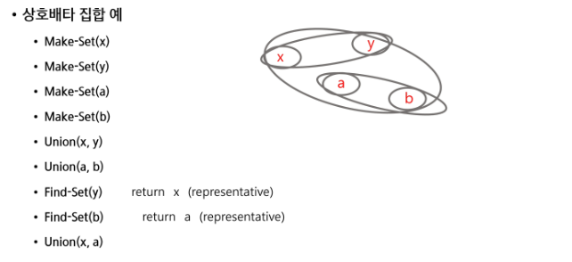
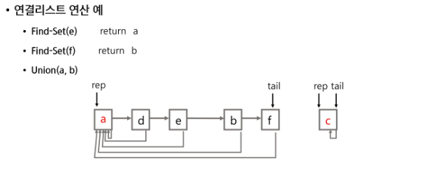
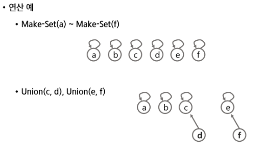
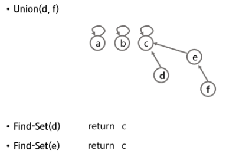
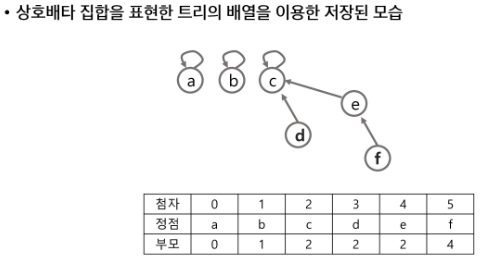

# 서로소 집합(Disjoint-sets)
- 서로소 또는 상호배타 집합들은 서로 중복 포함된 원소가 없는 집합들이다. 다시 말해 교집합이 없다.
- 집합에 속한 하나의 특정 멤버를 통해 각 집합들을 구분한다. 이를 대표자(representation)라 한다.

### 상호배타 집합을 표현하는 방법
- 연결 리스트
- 트리

### 상호배타 집합 연산
- Make-set(x)
- Find-set(x)
- Union(x, y)



## 상호 배타 집합 표현 - 연결리스트
- 같은 집합의 원소들은 하나의 연결리스트로 관리한다.
- 연결리스트의 맨 앞의 원소를 집합의 대표 원소로 삼는다.
- 각 원소는 집합의 대표 원소를 가리키는 링크를 갖는다.



## 상호 배타 집합 표현 - 트리
- 하나의 집합(a disjoint set)을 하나의 트리로 표현한다.
- 자식 노드가 부모 노드를 가리키며 루트 노드가 대표자가 된다.





## 상호배타 집합에 대한 연산
- Make-set(x): 유일한 멤버 x를 포함하는 새로운 집합을 생성하는 연산
    ```
    Make-set(x)
        p[x] <- x
    ```

- Find-set(x): x를 포함하는 집합을 찾는 연산
    ```
    Find-set(x)
        IF x == p[x]: RETURN x
        ELSE        : RETURN Find-set(p[x])
    ```
    ```
    반복
    Find-set(x)
        while x != p[x]
            x = p[x]
        return x
    ```
    > 특정 노드에서 루트까지의 경로를 찾아 가면서 노드의 부모 정보를 갱신한다.

- Union(x, y): x와 y를 포함하는 두 집합을 통합하는 연산
    ```
    Union(x, y)
        p[Find-set(y)] <- Find-set(x)
    ```
    ```
    Union(x, y)
        Link(Find_set(x), Find_set(y))
    ```
    ```
    Link(x, y)
        IF rank[x] > rank[y]
            p[y] <- x
        
        ELSE
            p[x] <- y
            IF rank[x] == rank[y]
                rank[y]++
    ```

#### 연산의 효율을 높이는 방법
- Rank를 이용한 Union
  - 각 노드는 자신을 루트로 하는 subtree의 높이를 랭크Rank라는 이름으로 저장한다.
  - 두 집합을 합칠 때 rank가 낮은 집합을 rank가 높은 집합에 붙인다.
- Path compression
  - Find-set을 행하는 과정에서 만나는 모든 노드들이 직접 root를 가리키도록 포인터를 바꾸어 준다.

