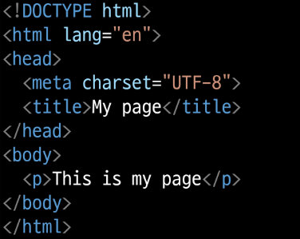
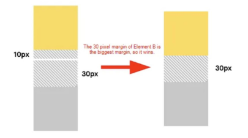
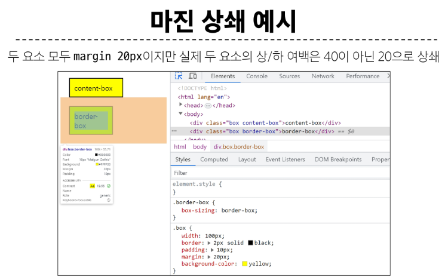
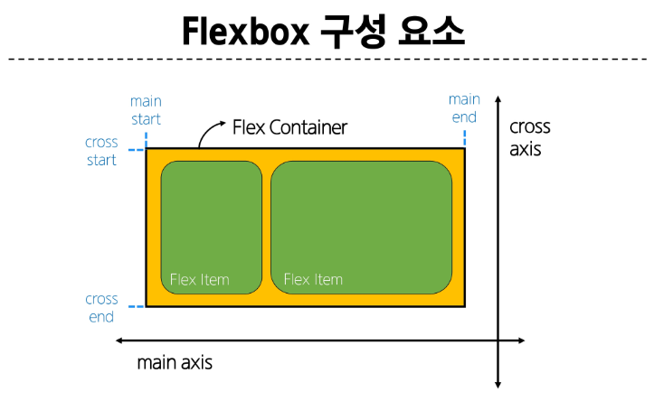
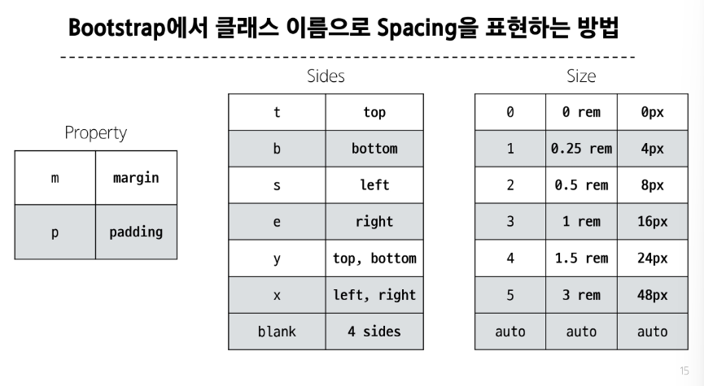
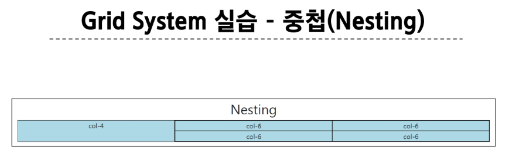
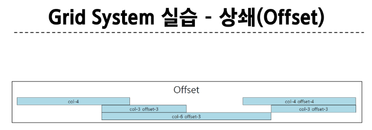

#  HTML 구조

> `<!DOCTYPE html>`: 해당 문서가 html로 문서라는 것을 나타냄
>
> `<html></html>`: 전체 페이지의 콘텐츠를 포함
>
> `<title></title>`: 브라우저 탭 및 즐겨찾기 시 표시되는 제목으로 사용
>
> `<head></head>`: HTML 문서에 관련된 설명, 설정 등 / 사용자에게 보이지 않음
>
> `<body></body>`: 페이지에 표시되는 모든 콘텐츠

## HTML Element(요소)
- 하나의 요소는 어는 태그와 닫는 태그 그리고 그 안의 내용으로 구성됨
- 닫는 태그는 태그 이름 앞에 슬래시가 포함되며 닫는 태그가 없는 태그도 존재
- 예: `<p></p>`

## HTML Attributes(속성)
### 규칙
- 속성은 요소 이름과 속성 사이에 공백이 있어야 함
- 하나 이상의 속성들이 있는 경우엔 속성 사이에 공백으로 구분함
- 속성 값은 열고 닫는 따옴표로 감싸야 함

### 목적
- 나타내고 싶지 않지만 추가적인 기능, 내용을 담고 싶을 때 사용
- CSS에서 해당 요소를 선택하기 위한 값으로 활용됨

## 대표적인 HTML Text structure
- Heading & Paragraphs: h1~6, p
- Lists: ol, ul, li
- Emphasis & Importance: em, strong


---
# CSS
### CSS 구문
```
h1 {
  color: red;
  font-size: 30px;
}
```
- h1: 선택자(Selector)
- color: red;: 선언(Declaration)
- font-size: 속성(Property)
- 30px;: 값(Value)

## CSS 적용 방법
1. 인라인(Inline) 스타일: HTML 요소 안에 style 속성 값으로 작성
2. 내부(Internal) 스타일 시트: head 태그 안에 style 태그에 작성
3. 외부(External) 스타일 시트: 별도의 CSS 파일 생성 후 HTML link 태그를 사용해 불러오기

## CSS Selectors(선택자) 종류
- 기본 선택자
  - 전체(*) 선택자: HTML 모든 요소를 선택
  - 요소(tag) 선택자: 지정한 모든 태그를 선택
  - 클래스(class) 선택자(.): 주어진 클래스 속성을 가진 모든 요소를 선택
  - 아이디(id) 선택자(#): 주어진 아이디 속성을 가진 요소 선택, 문서에는 주어진 아이디를 가진 요소가 하나만 있어야 함
  - 속성(atr) 선택자 등

- 결합자(Combinators)
  - 자손 결합자(" "(space))
    - 첫 번째 요소의 자손 요소들 선택
    - 예: p span은 `<p>` 안에 있는 모든 `<span>`를 선택(하위 레벨 상관 없이)
  - 자식 결합자(>)
    - 첫 번째 요소의 직계 자식만 선택
    - 예: ul > li은 `<ul>`안에 있는 모든 `<li>`를 선택(한 단계 아래 자식들만)

# 명시도(Specificity)
결과적으로 요소에 적용할 CSS 선언을 결정하기 위한 알고리즘

- CSS Selector에 가중치를 계산하여 어떤 스타일을 적용할지 결정
- 동일한 요소를 가리키는 2개 이상의 CSS 규칙이 있는 경우 가장 높은 명시도를 가진 Selector가 승리하여 스타일이 적용됨

### Cascade(계단식)
한 요소에 동일한 가중치를 가진 선택자가 적용될 때 CSS에서 마지막에 나오는 선언이 사용됨

### 명시도가 높은 순
1. Importance
   - !important
2. Inline 스타일
3. 선택자
   - id 선택자 > class 선택자 > 요소 선택자
4. 소스 코드 선언 순서

# 상속
1. 상속 되는 속성
   - Text 관련 요소(font, color,k text-align), opacity, visibility 등
2. 상속 되지 않는 속성
   - Box model 관련 요소(width, height, border, box-sizing, ...)
   - position 관련 요소(position, top/right/bottom/left, z-index) 등

# CSS Box Model
### Box 구성 요소
1. Margin: 이 박스와 다른 요소사이의 공백, 가장 바깥쪽 영역
2. Border: 콘텐츠와 패딩을 감싸는 테두리 영역
3. Padding: 콘텐츠 주위에 위치하는 공백 영역
4. Content: 콘텐츠가 표시되는 영역

### CSS가 width 값을 계산하는 기준: CSS는 border가 아닌 content의 크기를 width 값으로 지정
box-sizing 으로 width를 content-box, border-box 등에 맞춰줄 수 있음

### 박스 타입
1. block : 너비 100%
   - 항상 새로운 행으로 나뉨
   - width와 height 속성을 사용하여 너비와 높이를 지정할 수 있음
   - 기본적으로 width 속성을 지정하지 않으면 박스는 inline 방향으로 사용 가능한 공간을 모두 차지함(너비를 사용 가능한 공간의 100%로 채우는 것)
   - 대표적인 block 타입 태그(h1~6, p, div)

2. inline
   - 새로운 행으로 나뉘지 않음
   - width와 height 속성을 사용할 수 없음
   - 수직 방향
     - padding, margins, borders가 적용되지만 다른 요소를 밀어낼 수는 없음
   - 수평 방향
     - padding, margins, borders가 적용되지만 다른 요소를 밀어낼 수 있음
   - 대표적인 inline 타입 태그
     - a, img, span

### 기타 display 속성
1. inline-block
   - inline과 block 요소 사이의 중간 지점을 제공하는 display 값
   - block 요소의 특징을 가짐
     - width 및 height 속성 사용 가능
     - padding, margin 및 border로 인해 다른 요소가 밀려남
   - 요소가 줄 바꿈 되는 것을 원하지 않으 면서 너비와 높이를 적용하고 싶은 경우에 사용
2. none: 요소를 화면에 표시하지 않고, 공간조차 부여되지 않음

# shorthand 속성
1. border: width, style, color(예: `2px solid black;`)
2. margin & padding
   1. 4개: 상우하좌
   2. 3개: 상/좌우/하
   3. 2개: 상하/좌우
   4. 1개: 공통

# Margin clooapsing(마진 상쇄)
- 두 block 타입 요소의 margin top과 bottom이 만나 더 큰 margin으로 결합되는 현상
- 웹 개발자가 레이아웃을 더욱 쉽게 관리할 수 있도록 함
- 각 요소에 대한 상/하 margin을 각각 설정하지 않고 한 요소에 대해서만 설정하기 위함



# Position
### 유형별 특징
- static
  - 기본 값
  - 요소를 Normal Flow에 따라 배치
- relative
  - 요소를 Normal Flow에 따라 배치
  - 자기 자신을 기준으로 이동
  - 요소가 차지하는 공간은 static일 때와 같음
- absolute
  - 요소를 Normal Flow에서 제거
  - 가장 가까운 relative 부모 요소를 기준으로 이동
  - 문서에서 요소가 차지하는 공간이 없어짐
- fixed
  - 요소를 Normal Flow에서 제거
  - 현재 화면 영역을 기준으로 이동
  - 문서에서 요소가 차지하는 공간이 없어짐
- sticky
  - 요소를 Normal Flow에 따라 배치
  - 요소가 일반적인 문서 흐름에 따라 배치되다가 스크롤이 특정 임계점에 도달하면 그 위치에서 고정됨(fixed)
  - 만약 다음 sticky 요소가 나오면 다음 sticky 요소가 이전 sticky 요소의 자리를 대체
    - 이전 sticky 요소가 고정되어 있던 위치와 다음 sticky 요소가 고정되어야 할 위치가 겹치게 되기 때문

### z-index
- 정수 값을 사용해 Z축 순서를 지정
- 더 큰 값을 가진 요소가 작은 값의 요소를 덮음

# Flexbox

1. main axix(주 축)
   - flex item들이 배치되는 기본 축
   - main start 에서 시작하여 main end 방향으로 배치(기본 값)
2. cross axix(교차 축)
   - main axis 에 수직인 축
   - cross start에서 시작하여 cross end 방향으로 배치(기본 값)
3. Flex Container
   - display: flex; 혹은 display: inline-flex; 가 설정된 부모 요소
   - 이 컨테이너의 1차 자식 요소들이 Flex item이 됨
   - flexbox 속성 값들을 사용하여 자식 요소 Flex Item들을 배치하는 주제
4. Flex Item
   - Flex Container 내부에 레이아웃 되는 항목

## 레이아웃 구성
1. Flex Container 지정
   - 기본적으로 행으로 나열
   - 주 축의 시작 선에서 시작
   - 교차 축의 크기를 채우기 위해 늘어남
2. flex-direction
   - flex item이 나열되는 방향을 지점
   - column으로 지정할 경우 주 축이 변경됨
   - `-reverse`로 지정하면 배치의 시작 선과 끝 선이 서로 바뀜
3. flex-wrap
   - item 목록이 한 행에 들어가지 않을 경우 다른 행에 배치할지 여부 설정
4. justify-content
   - 주 축을 따라 flex item과 주위에 공간을 분배
5. align-content
   - 교차 축을 따라 flex item과 주위에 공간을 분배
     - flex-wrap이 wrap 또는 wrap-reverse로 설정된 여러 행에만 적용됨
     - 한 줄 짜리 행에는 효과 없음
6. flex-grow
   - 남는 행 여백을 비율에 따라 각 아이템에 분배
     - 아이템이 컨테이너 내에서 확장하는 비율을 지정
   - flex-grow의 반대는 flex-shrink
7. flex-basis
   - 아이템의 초기 크기 값을 지정
   - width보다 우선된다

# CDN
지리적 제약 없이 빠르고 안전하게 콘텐츠를 전송할 수 있는 전송 기술
- 서버와 사용자 사이의 물리적인 거리를 줄여 콘텐츠 로딩에 소요되는 시간을 최소화(웹 페이지 로드 속도를 높임)
- 지리적으로 사용자와 가까운 CDN 서버에 콘텐츠를 저장해서 사용자에게 전달

# Bootstrap
## 사용법
> `class = "mt-5"
>
> m: property
> t: sides
> 5: size



## Reset CSS
브라우저 별로 'user agent stylesheet'가 있어서 맞춰주려고 Reset
1. Normalize CSS: 표준에 맞춤

# Semantic Web
웹 데이터를 의미론적으로 구조화된 형태로 표현하는 방식
### HTML Semantic Element
기본적인 모양과 기능 이외에 의미를 가지는 HTML dyth

### 대표적인 Semantic Element
- header
- nav
- main
- article
- section
- aside
- footer

# CSS 방법론
## OOCSS
객체 지향적 접근법을 적용하여 CSS를 구성하는 방법론
### OOCSS 기본 원칙
1. 구조와 스킨을 분리
   - 모든 버튼의 공통 구조를 정의 + 각각의 스킨을 정의
2. 컨테이너와 콘텐츠를 분리 
   - 객체에 직접 적용하는 대신 객체를 둘러싸는 컨테이너에 스타일을 적용
   - 스타일을 정의할 때 위치에 의존적인 스타일을 사용하지 않도록 함
   - 콘텐츠를 다른 컨테이너로 이동시키거나 재배치할 때 스타일이 깨지는 것을 방지

# Bootstrap Grid system
## Grid system 기본 요소
1. Container: Column들을 담고 있는 공간
2. Column: 실제 컨텐츠를 포함하는 부분
3. Gutter: 컬럼과 컬럼 사이의 여백 영역(x축은 padding, y축은 margin으로 여백 생성)

1개의 row 안에 12개의 column 영역이 구성: 각 요소는 12개 중 몇 개를 차지할 것인지 지정됨

### 중첩(Nesting)


### 상쇄(Offset)


## The Grid System
- CSS가 아닌 편집 디자인에서 나온 개념으로 구성 요소를 잘 배치해서 시각적으로 좋은 결과물을 만들기 위함
- 기본적으로 안쪽에 있는 요소들의 오와 열을 맞추는 것에서 기인
- 정보 구조와 배열을 체계적으로 작성하여 정보의 질서를 부여하는 시스템

# 반응형 웹 디자인
디바이스 종류나 화면 크기에 상관없이, 어디서든 일관된 레이아웃 및 사용자 경험을 제공하는 디자인 기술
> Bootstrap gird system에서는 12개 column과 6개 breakpoints를 사용하여 반응형 웹 디자인을 구현
>
> 화면 너비에 따라 6개의 분기점 제공
>
> xs, sm, md, lg, xl, xxl
>
> 각 breakpoints마다 설정된 최대 너비 값 '이상으로' 화면이 커지면 grid system 동작이 변경됨
