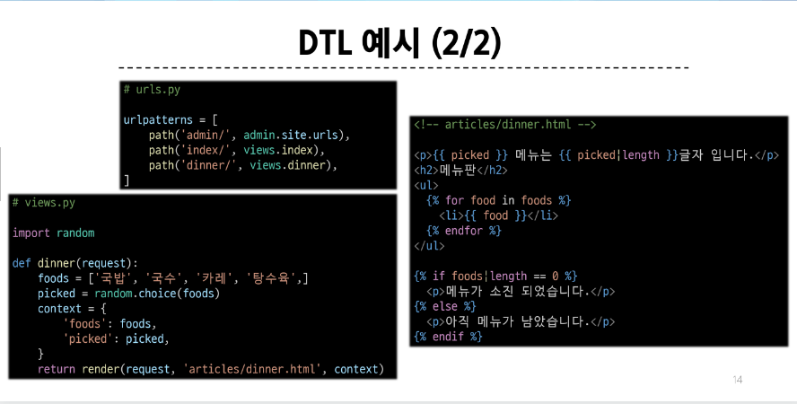
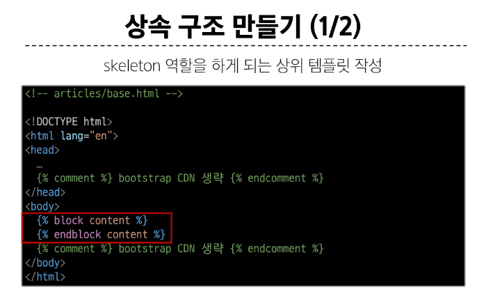
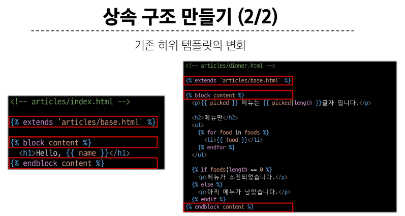
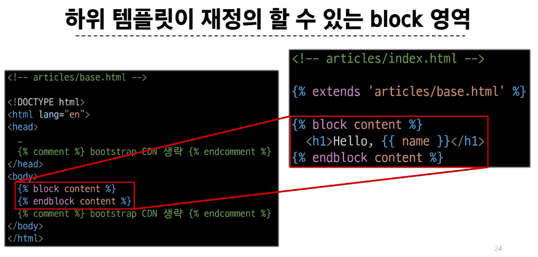
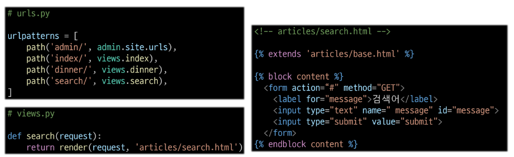
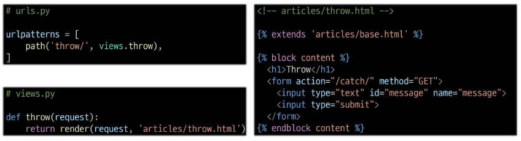
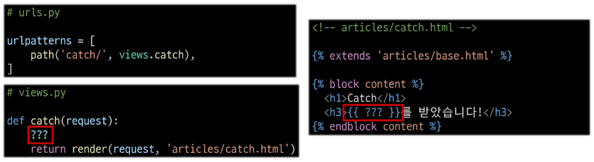

> 1. 가상 환경 생성
> 2. .gitignore 생성
> 3. django 설치
> 4. requirements.txt 생성
> 5. project 생성 -> my_second_pjt
> 6. app 생성 -> articles
> 7. base template 생성
> 8. 각종 기능 생성...
>     1. variable routing

# Django Template Language(DTL)

## 1. Variable
- render 함수의 세 번째 인자로 딕셔너리 데이터를 사용
- 딕셔너리 key에 해당하는 문자열이 template에서 사용 가능한 변수명이 됨
- dot('.')를 사용하여 변수 속성에 접근할 수 있음

## 2. Filters
- 표시할 변수를 수정할 때 사용 (변수 + '|' + 필터)
- chained(연결)이 가능하며 일부 필터는 인자를 받기도 함
- 약 60개의 built-in template filters를 제공

## 3. Tags
- 반복 또는 논리를 수행하여 제어 프름을 만듦
- 일부 태그는 시작과 종료 태그가 필요
- 약 24개의 built-in template tags를 제공
  
## 4. Comments
- DTL에서의 주석
  

# 템플릿 상속
1. 페이지의 공통 요소를 포함하고,
2. 하위 템플릿이 재정의 할 수 있는 공간을 정의하는 기본 'skeleton'템플릿을 작성하여 상속 구조를 구축

## tags
1. `extends` tag: 자식(하위) 템플릿이 부모 템플릿을 확장한다는 것을 알림
   - 반드시 자식 템플릿 최상단에 작성되어야 함(2개 이상 사용 불가)
   - ``

2. `block` tag: 하위 템플릿에서 재정의 할 수 있는 블록을 정의 (상위 템플릿에 작성하며 하위 템플릿이 작성할 수 있는 공간을 지정하는 것)
   - ` `
   - 사이에 작성한 내용은 <head> 에 작성한 것과 같음
   - 

# HTML form

`http://127.0.0.1:8000/search/?message=hello`
- `message`: input name
- `hello`: input에 입력한 data

`https://search.naver.com/search.naver?query=hello`
- `https://search.anver.com/search.naver`: 목적지 URL
- `query`: input의 name 속성
- `hello`: input에 입력한 data

## action과 method
1. action
   - 입력 데이터가 전송된 URL을 지정(목적지)
   - 만약 이 속성을 지정하지 않으면 데이터는 현재 form이 있는 페이지의 URL로 보내짐

2. method
   - 데이터를 어떤 방식으로 보낼 것인지 정의
   - 데이터의 HTTP request methods (GET, POST)를 지정

3. `input` element: 사용자의 데이터를 입력받을 수 있는 요소 (type 속성 값에 따라 다양한 유형의 입력 데이터를 받음)
4. `name` attribute: 입력한 데이터에 붙이는 이름(key)
   - 데이터를 제출했을 때 서버는 name 속성에 설정된 값을 통해서만 사용자가 입력한 데이터에 접근할 수 있음

### Query String Parameters
- 사용자의 입력 데이터를 URL 주소에 파라미터를 통해 서버로 보내는 방법
- 문자열은 앰퍼샌드('&')로 연결된 key=value 쌍으로 구성되며, 기본 URL과는 물음표('?')로 구분됨
- 예시: `http://host:port/path?key=value&key=value`

## form 활용
1. throw 로직 작성

2. catch 로직 작성

