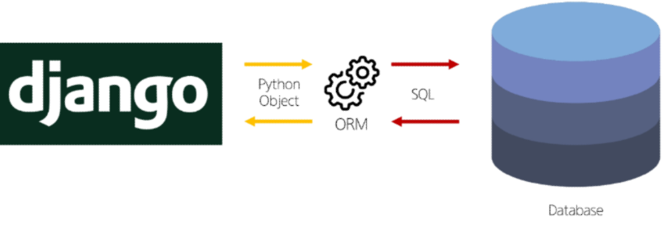
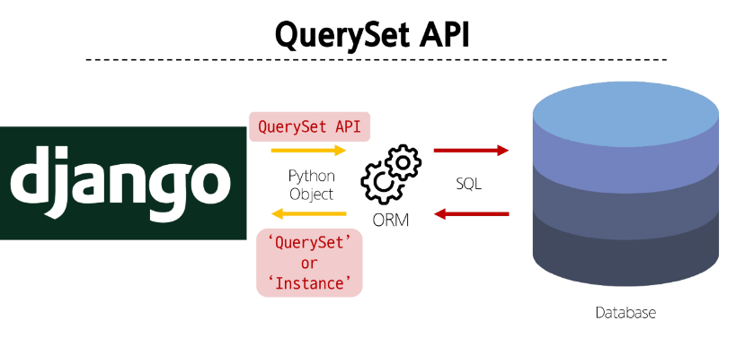
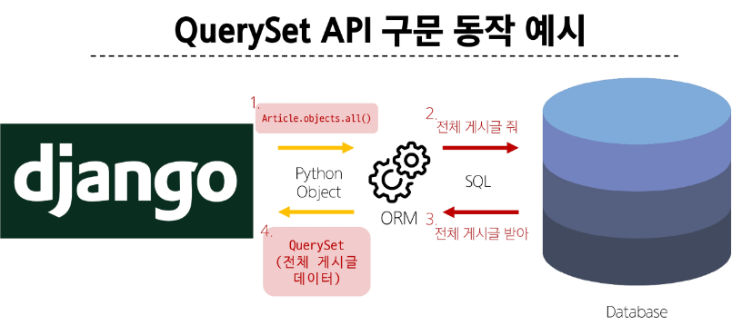

# ORM
#### 중간에서 python 과 SQL을 해석

# QuerySet API
ORM에서 데이터를 검색, 필터링, 정렬 및 그룹화 하는 데 사용하는 도구
- API를 사용하여 SQL이 아닌 Python 코드로 데이터를 처리

## QuerySet API 구문
> `Articel.object.all()`
> 
> - `Article`: Model class 
> - `objects`: Manager
> - `all()`: Queryset API

## Query
- 데이터베이스에 특정한 데이터를 보여달라는 요청
- "쿼리문을 작성한다": 원하는 데이터를 얻기 위해 데이터베이스에 요청을 보낼 코드를 작성한다.
- 파이썬으로 작성한 코드가 ORM에 의해 SQL로 변환되어 데이터베이스에 전달되며, 데이터베이스의 응답 데이터를 ORM이 QuerySet이라는 자료 형태로 변환하여 우리에게 전달

## QuerySet
- 데이터베이스에게서 전달 받은 객체 목록(데이터 모음)
  - 순회가 가능한 데이터로써 1개 이상의 데이터를 불러와 사용할 수 있음
- Django ORM을 통해 만들어진 자료형
- 단, 데이터베이스가 단일한 객체를 반환 할 때는 QuerySet이 아닌 모델(Class)의 인스턴스로 반환됨

## QuerySet API
#### Python의 모델 클래스와 인스턴스를 활용해 DB에 데이터를 저장, 조회, 수정, 삭제하는 것