# 1. Intro
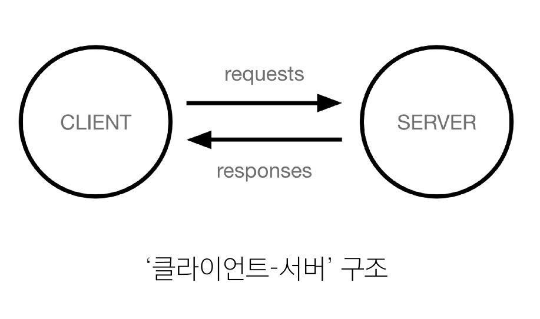
- 클라이언트: 서비스를 요청하는 주체(웹 사용자의 인터넷이 연결된 장치, 웹 브라우저)
- 서버: 클라이언트의 요청에 응답하는 주체(웹 페이지, 앱을 저장하는 컴퓨터)

#### 우리가 웹 페이지를 보게 되는 과정
> 1. 웹 브라우저(클라이언트)에서 'google.com'을 입력
> 2. 브라우저는 인터넷에 연결된 전세계 어딘 가에 구글 컴퓨터(서버)에게 'Google 홈페이지.html' 파일을 달라고 요청
> 3. 요청을 받은 구글 컴퓨터는 데이터베이스에서 'Google 홈페이지.html' 파일을 찾아 응답
> 4. 전달받은 'Google 홈페이지.html' 파일을 사람이 볼 수 있도록 웹 브라우저가 해석해주면서 사용자는 구글의 메인 페이지를 보게 됨.

## 웹 개발에서의 Frontend와 Backend
- Frontend (프론트엔드)
  - 사용자 인터페이스(UI)를 구성하고, 사용자가 애플리케이션과 상호작용할 수 있도록 함
  - HTML, CSS, JavaScript, 프론트엔드 프레임워크 등
- Backend (백엔드)
  - 서버 측에서 동작하며, 클라이언트의 요청에 대한 처리와 데이터베이스와의 상호작용 등을 담당
  - 서버 언어(Python, Java 등) 및 백엔드 프레임워크, 데이터베이스, API, 보안 등

## Framework
#### '웹 서비스 개발'에는 무엇이 필요할까?
- 로그인, 로그아웃, 회원관리, 데이터베이스, 보안 등 너무 많은 기술들이 필요
- 하나부터 열까지 개발자가 모두 작성하는 것은 현실적으로 어려움
- 하지만 모든 걸 직접 만들 필요가 없음
- 잘 만들어진 것들을 가져와 좋은 환경에서 내 것으로 잘 사용하는 것도 능력인 시대
- `거인의 어깨 위에서 프로그래밍하기`

#### Web Framework
웹 애플리케이션을 빠르게 개발할 수 있도록 도와주는 도구 (개발에 필요한 기본 구조, 규칙, 라이브러리 등을 제공)

#### Django Framework
Python 기반의 대표적인 웹 프레임워크

## 디자인 패턴
소프트웨어 설계 발생하는 문제를 해결하기 위한 일반적인 해결책 (공통적인 문제를 해결하는 데 쓰이는 형식화 된 관행)

"애플리케이션의 구조는 이렇게 구성하자" 라는 관행

#### MVC 디자인 패턴 (Model, View, Controller)
- 애플리케이션을 구조화하는 대표적인 패턴 ('데이터' & '사용자 인터페이스' & '비즈니스 로직'을 분리)
  - 시각적 요소와 뒤에서 실행하는 로직을 서로 영향 없이, 독립적이고 쉽게 유지 보수할 수 있는 애플리케이션을 만들기 위해

#### MTV 디자인 패턴 (Model, Template, View)
- Django에서 애플리케이션을 구조화하는 패턴
- 기존 MVC 패턴과 동일하나 단순히 명칭을 다르게 정의한 것

## app
1. 앱 생성
2. 앱 등록
   - 반드시 앱을 생성한 후에 등록해야 함
   - `settings.py` > `INSTALLED_APPS = ['articles'], ...`

## 프로젝트 구조
- `settings.py`: 프로젝트의 모든 설정을 관리
- `urls.py`: 요청 들어오는 URL에 따라 이에 해당하는 적절한 views를 연결
---
- `__init__.py`: 해당 폴더를 패키지로 인식하도록 설정하는 파일
- `asgi.py`: 비동기식 웹 서버와의 연결 관련 설정
- `wsgi.py`: 웹 서버와의 연결 관련 설정
- `manage.py`: Django 프로젝트와 다양한 방법으로 상호작용 하는 커맨드라인 유틸리티

## 앱 구조
- `admin.py`: 관리자용 페이지 설정
- `models.py`: DB와 관련된 Model을 정의, MTV 패턴의 M
- `views.py`: HTTP 요청을 처리하고 해당 요청에 대한 응답을 반환(url, model, template과의 연계), MTV 패턴의 V
---
- `apps.py`: 앱의 정보가 작성된 곳
- `tests.py`: 프로젝트 테스트 코드를 작성하는 곳


## 요청과 응답
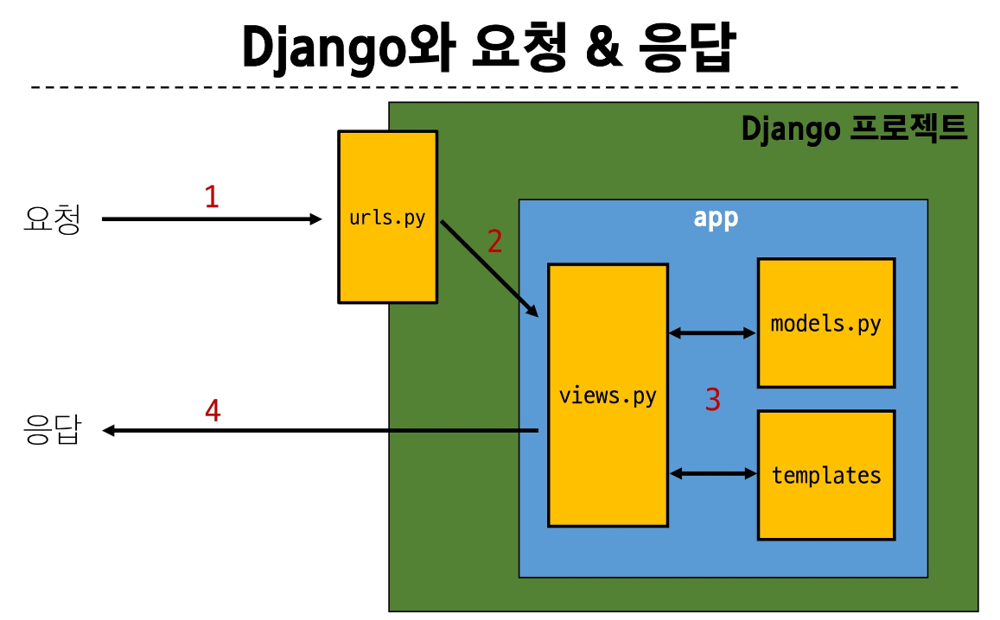
1. URLs
```py
# urls.py

from articles import views

urlpatterns = [
  path('index/', views.index),
]

# 각 url경로는 반드시 '/'로 끝남
```

2. View
```py
# views.py

from Django.shortcuts import render

def index(request):
  return render(reqeust, 'articles/index.html')

# 특정 경로에 있는 template과 request 객체를 결합해 응답 객체를 반환하는 index view 함수 정의
# 모든 view 함수는 첫 번째 인자로 request 요청 객체를 필수적으로 받음
```
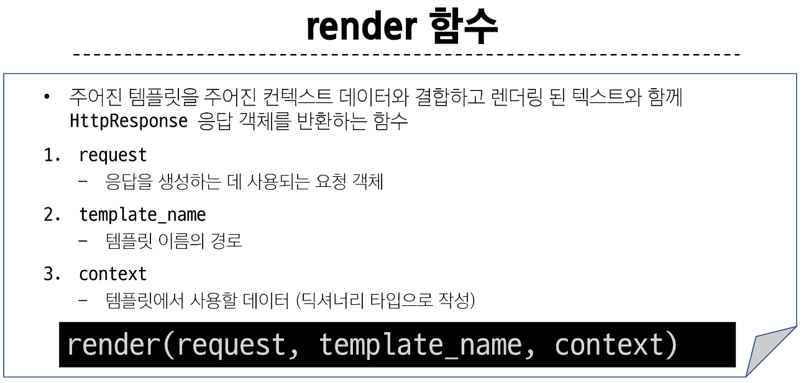

3. Template
   1. articles 앱 폴더 안에 templates 폴더 생성
   2. templates 폴더 안에 articles 폴더 생성
   3. articles 폴더 안에 템플릿 파일 생성
   4. 정해진 경로에 있는 template 파일만 읽어올 수 있음

#### 데이터 흐름에 따른 코드 작성하기
URLs -> View -> Template

## MTV 디자인 패턴 정리
- Model
  - 데이터와 관련된 로직을 관리
  - 응용 프로그램의 데이터 구조를 정의하고 데이터베이스의 기록을 관리
- Template
  - 레이아웃과 화면을 처리
  - 화면상의 사용자 인터페이서 구조와 레이아웃을 정의
- View
  - Model & Template과 관련한 로직을 처리해서 응답을 반환
  - 클라이언트의 요청에 대해 처리를 분기하는 역할
- View 예시
  - 데이터가 필요하다면 model에 접근해서 데이터를 가져오고,
  - 가져온 데이터를 template로 보내 화면을 구성하고,
  - 구성된 화면을 응답으로 만들어 클라이언트에게 반환

# 2. Template
Django Template system: 데이터 표현을 제어하면서, 표현과 관련된 부분을 담당

#### Django Template Language(DTL)
Template에서 조건, 반복, 변수 등의 프로그래밍적 기능을 제공하는 시스템

1. Variable
   - render 함수의 세 번째 인자로 딕셔너리 데이터를 사용
   - 딕셔너리 key에 해당하는 문자열이 template에서 사용 가능한 변수명이 됨
   - dot('.')를 사용하여 변수 속성에 접근할 수 있음
   - `{{ variable }}`, `{{ variable.attribute }}`

2. Filters
   - 표시할 변수를 수정할 때 사용 (변수+ '|' + 필터)
   - chaned(연결)이 가능하며 일부 필터는 인자를 받기도 함
   - `{{ variable|filter }}`, `{{ name|truncatewords:30 }}`

3. Tags
   - 반복 또는 논리를 수행하여 제어 흐름을 만듦
   - 일부 태그는 시작과 종료 태그가 필요
   - ``, ` `

4. Comments
   - DTL에서의 주석

## 템플릿 상속
페이지의 공통요소를 포함하고, 하위 템플릿이 재정의 할 수 있는 공간을 정의하는 기본 'skeleton' 템플릿을 작성하여 상속 구조를 구축

1. 'extends' tag
   - ``
   - 자식(하위)템플릿이 부모 템플릿을 확장한다는 것을 알림
   - 반드시 자식 템플릿 최상단에 작성되어야 함(2개 이상 사용 불가)

2. 'block' tag
   - 하위 템플릿에서 재정의 할 수 있는 블록을 정의
   - 상위 템플릿에 작성하며 하위 템플릿이 작성할 수 있는 공간을 지정하는 것

## HTML form
HTML 'form'은 HTTP 요청을 서버에 보내는 가장 편리한 방법

### 1. 'form' element
- 사용자로부터 할당된 데이터를 서버로 전송
- 웹에서 사용자 정보를 입력하는 여러 방식(text, password, checkbox 등)을 제공

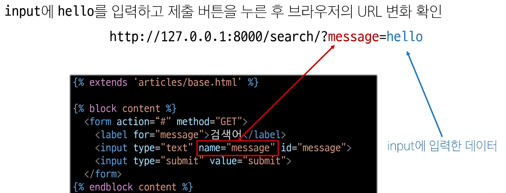

### 2. 'action' & 'method'
데이터를 어디(action)로 어떤 방식(method)으로 요청할지

- action
  - 입력 데이터가 전송될 URL을 지정(목적지)
  - 만약 이 속성을 지정하지 않으면 데이터는 현재 form이 있는 페이지의 URL로 보내짐
- method
  - 데이터를 어떤 방식으로 보낼 것인지 정의
  - 데이터의 HTTP request methos (GET, POST)를 지정

### 3. 'input' element
사용자의 데이터를 입력 받을 수 있는 요소(type 속성 값에 따라 다양한 유형의 입력 데이터를 받음)

### 4. 'name' attribute (input의 핵심 속성)
- 입력한 데이터에 붙이는 이름(key)
- 데이터를 제출했을 때 서버는 name 속성에 설정된 값을 통해서만 사용자가 입력한 데이터에 접근할 수 있음

#### Query String Parameters
- 사용자의 입력 데이터를 URL 주소에 파라미터를 통해 서버로 보내는 방법
- 문자열은 &로 연결된 key=value 쌍으로 구성되며, 기본 URL과는 ?로 구분됨
- 예시: `http://host:port/path?key=value?path=value`

## URL
### Variable routing
URL 일부에 변수를 포함시키는 것(변수는 view 함수의 인자로 전달할 수 있음)

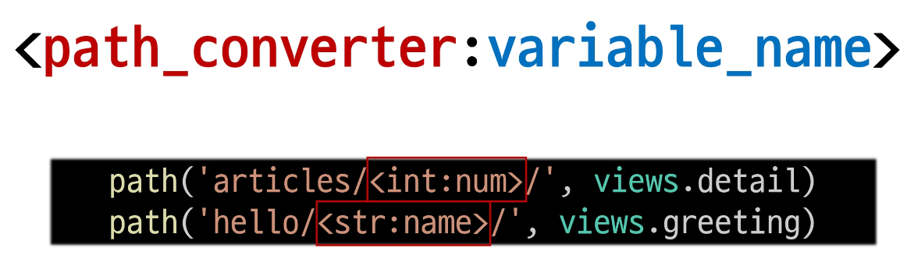

### Path converters
URL 변수의 타입을 지정(str, int 등 5가지 타입 지원)

# 3. URLs

## URL dispatcher
URL 패턴을 정의하고 해당 패턴이 일치하는 요청을 처리할 view 함수를 연결(매핑)

## App URL mapping
각 앱에 URL을 정의하는 것(프로젝트와 각 앱이 URL을 나누어 관리를 편하게 하기 위함)

### include()
- 프로젝트 내부의 앱들의 URL을 참조할 수 있도록 매핑하는 함수
- URL의 일치하는 부분까지 잘라내고, 남은 문자열 부분은 후속 처리를 위해 include된 URL로 전달

## Naming URL patterns
URL에 이름을 지정하는 것(path 함수의 name 인자를 정의해서 사용)

### 'url' tag
주어진 URL 패턴의 이름과 일치하는 절대 경로 주소를 반환(``)

## 'app_name' 속성 지정
```py
# articles/urls.py

app_name = 'pages'
urlpatterns = [
  ...,
]
```

## Model
### Django Model
- DB의 테이블을 정의하고 데이터를 조작할 수 있는 기능들을 제공
- 테이블 구조를 설계하는 '청사진(blueprint)'

### model 클래스 살펴보기
- django.db.models 모듈의 Model이라는 부모 클래스를 상속받음
```py
# articles/models.py

class Article(models.Model):
  title = models.CharField()
```

### Migrations
model 클래스의 변경사항(필드 생성, 수정, 삭제 등)을 DB에 최종 반영하는 방법
1. `$ python manage.py makemigrations`: model class를 기반으로 최종 설계도(migration) 작성
2. `$ python manage.py migrate`: 최종 설계도를 DB에 전달하여 반영

## Model Field
DB 테이블의 필드(열)을 정의하며, 해당 필드에 저장되는 데이터 타입과 제약 조건을 정의

### DateTimeField의 선택인자
- auto_now: 데이터가 저장될 때마다 자동으로 현재 날짜 시간을 저장
- auto_now_add: 데이터가 처음 생성될 때만 자동으로 현재 날짜 시간을 저장

## admin side
1. admin 계정 생성
2. admin에 모델 클래스 등록
```py
# articles/admin.py

from .models import Article

admin.site.register(Article)
```

# 4. ORM
- Object-Relational-Mapping
- 객체 지향 프로그래밍 언어를 사용하여 호환되지 않는 유형의 시스템 간에 데이터를 변환하는 기술
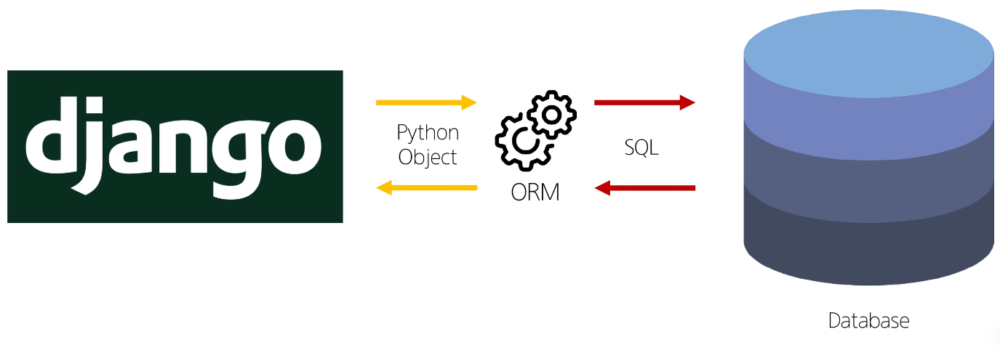

## QuerySet API
- ORM에서 데이터를 검색, 필터링, 정렬 및 그룹화 하는 데 사용하는 도구
- API를 사용하여 SQL이 아닌 Python 코드로 데이터를 처리
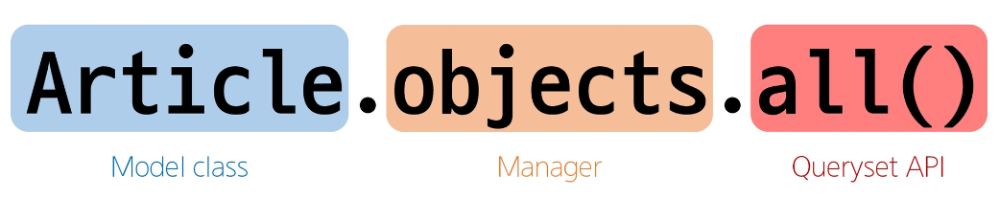
- 단, 단일 객체 반환시 QuerySet이 아닌 Class의 인스턴스로 반환됨
#### QuerySet API는 python의 모델 클래스와 인스턴스를 활용해 DB에 데이터를 저장, 조회, 수정, 삭제하는 것

## 1. create
`$ python manage.py shell_plus`

1.
```
article = Article()

article.title = 'first'
article.content = 'test'

article.save()
```

2.
```
`article = Article(title='first', content='test')

`article.save()`
```

3.
```
Article.objects.create(title='first', content='test')
```

## 2. Read
- Return new QuerySets
  - all()
  - filter()
- Do not return QuerySets
  - get()

#### get() 특징
- 객체를 찾을 수 없으면 DoesNotExist 예외를 발생
- 둘 이상의 객체를 찾으면 MultipleObejctsReturned 예외를 발생
- pk와 같이 고유성(uniqueness) 을 보장하는 조회에서 사용해야 함

## 3. Update
1. 조회: `article = Article.objests.get(pk=1)`
2. 변경: `article.title = 'second'`
3. 저장: `article.save()`

## 4. Delete
```
article = Article.objects.get(pk=1)

article.delete()
```

# 5. ORM with View

## HTTP
네트워크 상에서 데이터를 주고 받기위한 약속

## HTTP request methods
데이터(리소스)에 어떤 요청(행동)을 원하는지를 나타내는 것(GET & POST)

1. 'GET' Method
특정 데이터를 조회하는 요청(데이터를 전달할 때 URL에서 Query String 형식으로 보내짐)

2. 'POST' Method
특정 리소스에 변경(생성, 수정, 삭제)을 요구하는 요청(데이터는 전달할 때 HTTP Body에 담겨 보내짐)

## HTTP response status code
특정 HTTP 요청이 성공적으로 완료되었는지를 3자리 숫자로 표헌하기로 약속한 것
- `403 Forbidden`: 서버에 요청이 전달되었지만, 권한 때문에 거절되었다는 것을 의미

#### CSRF(Cross-Site-Request-Forgery), 사이트 간 요청 위조
사용자가 자신의 의지와 무관하게 공격자가 의도한 행동을 하여 특정 웹 페이지를 보안에 취약하게 하거나 수정, 삭제 등의 작업을 하게 만드는 공격 방법
- 요청 시 토큰 값도 함께 서버로 전송될 수 있도록 한다.

## redirect
- 게시글 작성 후 완료를 알리는 페이지를 응답하는 것
- 데이터 저장 후 페이지를 주는 것이 아닌 다른 페이지로 사용자를 보내야 한다.

### redirect()
클라이언트가 인자에 작성된 주소로 다시 요청을 보내도록 하는 함수

## DELETE 구현
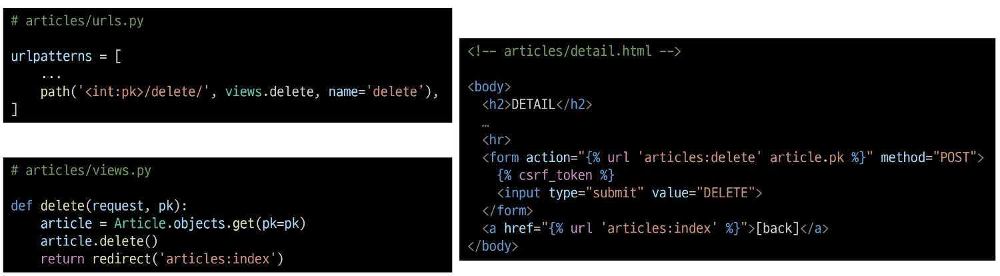

## GET 과 POST
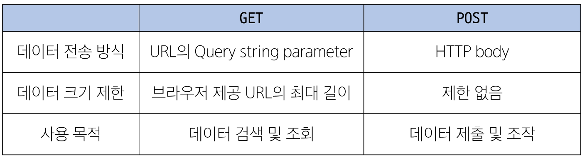

## 캐시(Cache)
- 데이터나 정보를 임시로 저장해두는 메모리나 디스크 공간
- 이전에 접근한 데이터를 빠르게 검색하고 접근할 수 있도록 함

# 6. Django Form

## 유효성 검사
수집한 데이터가 정확하고 유효한지 확인하는 과정

## ModelForm
- Form: 사용자 입력 데이터를 DB에 저장하지 않을 때
- ModelForm: 사용자 입력 데이터를 DB에 저장해야 할 때

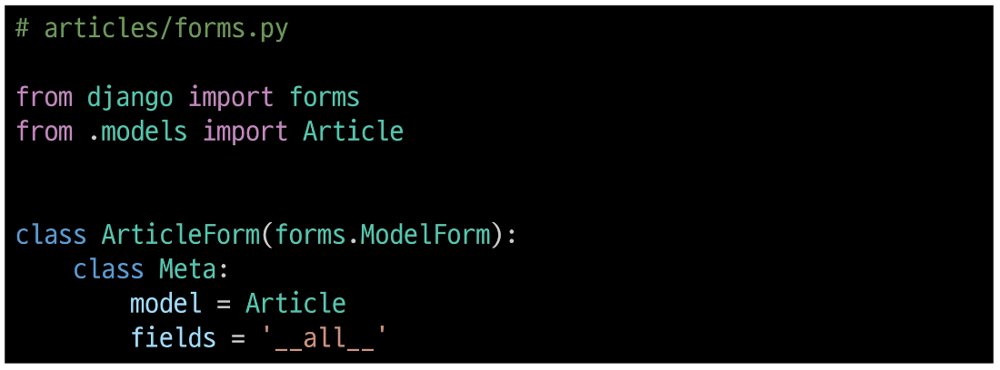
'fields', 'exclude' 속성을 사용해서 모델의 필드를 지정할 수 있음

## save()
생성과 수정의 구분은 키워드 인자 instance 여부로 구분함
1. create
```
form = ArticleForm(request.POST)
form.save()
```
2. update
```
form = ArticleForm(request.POST, instance=article)
form.save()
```
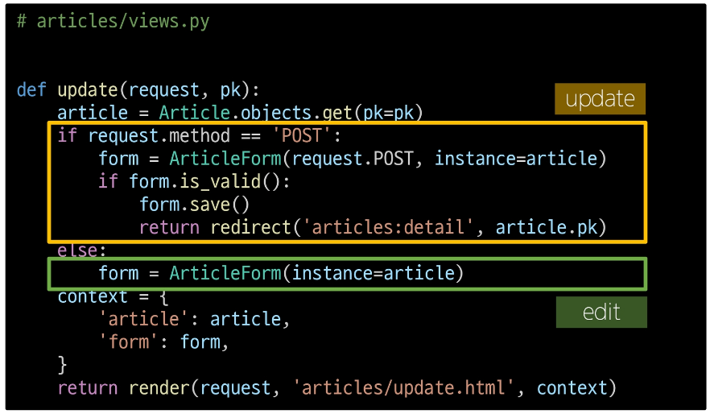

## Widget 응용
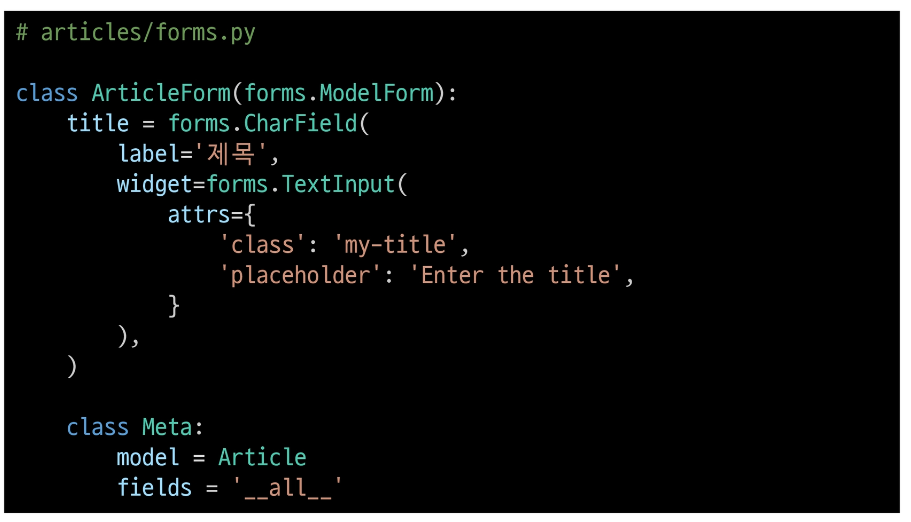

# 7. Static files
서버 측에서 변경되지 않고 고정적으로 제공되는 파일(이미지, JS, CSS 파일 등)

## Static files 제공
1. 기본 경로: `app폴더/static/`
   - static tag를 사용해 이미지 파일에 대한 경로 제공
   - ``
   - STATIC_URL
     - 기본 경로 및 추가 경로에 위치한 정적 파일을 참조하기 위한 URL
     - 실제 파일이나 디렉토리가 아니며, URL로만 존재
     - `settings.py` > `STATIC_URL = 'static/'`
     - URL + STATIC_URL + 정적 파일 경로

2. 추가 경로: `STATICFILES_DIRS`에 문자열 값으로 추가 경로 설정
   - `settings.py` > `STATICFILES_DIRS = [BASE_DIR / 'static', ]`

## Media files
1. ImageField()
   - 이미지 업로드에 사용하는 모델 필드
   - 이미지 객체가 직접 저장되는 것이 아닌 '이미지 파일의 경로'가 문자열로 DB에 저장
   - `settings.py` > `MEDIA_ROOT = [BASE_DIR / 'media', ]`
   - `settings.py` > `MEDIA_URL = 'static/'`
   - 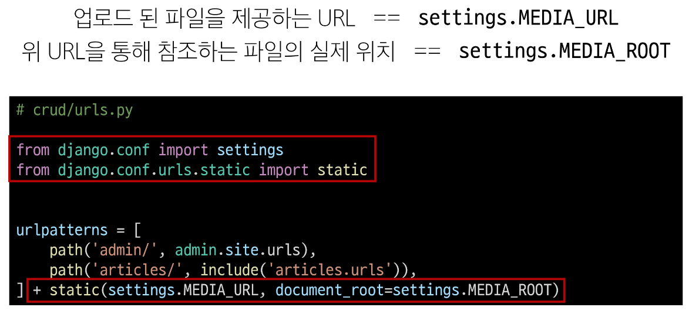

### 이미지 업로드
1. `image = models.ImageField(blank=True)` 로 빈 문자열이 저장될 수 있도록 제약 조건 설정
2. migration
3. form 요소의 enctype 속성 추가(`form enctype="multipart/form-data"`)
4. view 함수에서 업로드 파일에 대한 추가 코드 작성(`form=ArticleForm(request.POST, request.FILES)`)

### 업로드 이미지 제공
- 'url'속성을 통해 업로드 파일의 경로 값을 얻을 수 있음
- `article.image.url`: 업로드 파일의 경로
- `article.image`: 업로드 파일의 이름
- 이미지를 업로드 하지 않으면 렌더링 할 수 없으니 이미지가 있는 경우에만 출력하도록 처리
- 수정 페이지 form 요소에 enctype 속성 추가

## 'upload_to' argument
- ImageField()의 upload_to 인자를 사용해 미디어 파일 추가 경로 설정
- `image = models.ImageField(blank=True, upload_to='images/')`

# 8. Authentication System 1

## Cookie & Session
- 우리는 서버로부터 받은 페이지를 둘러볼 때 서버와 서로 연결되어 있는 상태가 아님

### HTTP
- HTML 문서와 같은 리소스들을 가져올 수 있도록 해주는 규약
- 웹에서 이루어지는 모든 데이터 교환의 기초
- 비연결 지향(서버는 요청에 대한 응답을 보낸 후 연결을 끊음)
- 무상태(연결을 끊는 순간 클라이언트와 서버 간의 통신이 끝나며 상태 정보가 유지되지 않음)

## 쿠키(Cookie)
- 서버가 사용자의 웹 브라우저에 전송하는 작은 데이터 조각
- 클라이언트 측에서 저장되는 작은 데이터 파일이며, 사용자 인증, 추적, 상태 유지 등에 사용되는 데이터 저장 방식
- 서버로부터 쿠키를 받고 같은 서버에 다른 페이지로 재요청시마다 저장해 놓았던 쿠키를 함께 전송

#### 쿠키 사용 원리
1. 브라우저(클라이언트)는 쿠키를 KEY-VALUE의 데이터 형식으로 저장
2. 이렇게 쿠키를 저장해 놓았다가, 동일한 서버에 재요청 시 저장된 쿠키를 함께 전송
3. 쿠키는 두 요청이 동일한 브라우저에서 들어왔는지 아닌지를 판단할 때 주로 사용됨
   - 이를 이용해 사용자의 로그인 상태를 유지할 수 있음
   - 상태가 없는 HTTP 프로토콜에서 상태 정보를 기억 시켜 주기 때문

#### 쿠키 사용 목적
1. 세션 관리: 로그인, 아이디 자동 완성, 공지 하루 안 보기, 장바구니 등의 정보 관리
2. 개인화: 사용자 선호, 테마 등의 설정
3. 트래킹: 사용자 행동을 기록 및 분석

## 세션(Session)
서버 측에서 생성되어 클라이언트와 서버 간의 상태를 유지, 상태 정보를 저장하는 데이터 저장 방식
- 쿠키에 세션 데이터를 저장하여 매 요청시마다 세션 데이터를 함께 보냄

#### 세션 작동 원리
1. 클라이언트가 로그인을 하면 서버가 session 데이터를 생성 후 저장
2. 생성된 session 데이터에 인증 할 수 있는 session id를 발급
3. 발급한 session id를 클라이언트에게 응답
4. 클라이언트는 응답 받은 session id를 쿠키에 저장
5. 클라이언트가 다시 동일한 서버에 접속하면 요청과 함께 쿠키(session id가 저장된)를 서버에 전달
6. 쿠키는 요청 때마다 서버에 함께 전송되므로 서버에서 session id를 확인해 로그인 되어있다는 것을 알도록 함

> 서버 측에서는 세션 데이터를 생성 후 저장하고 이 데이터에 접근할 수 있는 세션 ID를 생성
> 
> 이 ID를 클라이언트 측으로 전달하고, 클라이언트는 쿠키에 이 ID를 저장
>
> 이후 클라이언트가 같은 서버에 재요청 시마다 저장해두었던 쿠키도 요청과 함께 전송
> - 예를 들어 로그인 상태 유지를 위해 로그인 되어있다는 사실을 입증하는 데이터를 매 요청마다 계속해서 보내는 것

#### 쿠키와 세션의 목적
서버와 클라이언트 간의 '상태'를 유지

### 쿠키 종류 별 수명
1. session cookie
   1. 현재 세션이 종료되면 삭제됨
   2. 브라우저 종료와 함께 세션이 삭제됨
2. persistent cookies
   1. expires 속성에 지정된 날짜 혹은 Max-Age 속성에 지정된 기간이 지나면 삭제됨

## Django Authentication System (인증 시스템)
사용자 인증과 관련된 기능을 모아 놓은 시스템

1. User 클래스를 Custom User model로 대체
   1. `accounts/models.py` > `class User(AbstractUser): pass`
   2. `settings.py` > `AUTH_USER_MODEL = 'accounts.User'`

### Login
session을 create하는 과정

- AuthenticationForm(): 로그인 인증에 사용할 데이터를 입력 받는 built-in form
- login(request, user): 인증된 사용자를 로그인 하는 함수
- get_user(): 유효성 검사를 통과했을 경우 로그인 한 사용자 객체를 반환

### Logout
session을 delete하는 과정

- logout(request): 현재 요청에 대한 Session Data를 DB에서 삭제, 클라이언트의 쿠키에서도 Session Id를 삭제

## context processors
- 템플릿이 렌더링 될 때 호출 가능한 컨텍스트 데이터 목록
- 작성된 컨텍스트 데이터는 기본적으로 템플릿에서 사용 가능한 변수로 포함됨
- django에서 자주 사용하는 데이터 목록을 미리 템플릿에 로드 해 둔 것

## Abstact base classes(추상 기본 클래스)
- 몇 가지 공통 정보를 여러 다른 모델에 넣을 때 사용하는 클래스
- 데이터베이스 테이블을 만드는 데 사용되지 않으며, 대신 다른 모델의 기본 클래스로 사용되는 경우 해당 필드가 하위 클래스의 필드에 추가 됨