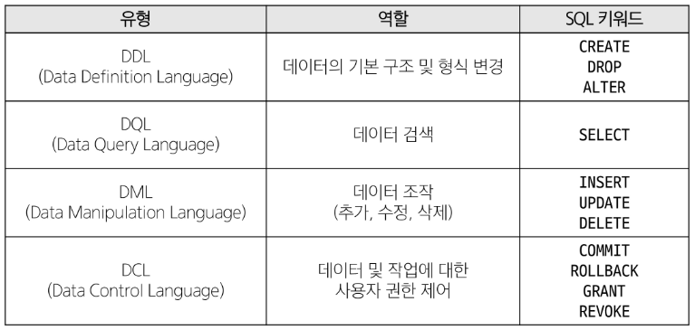
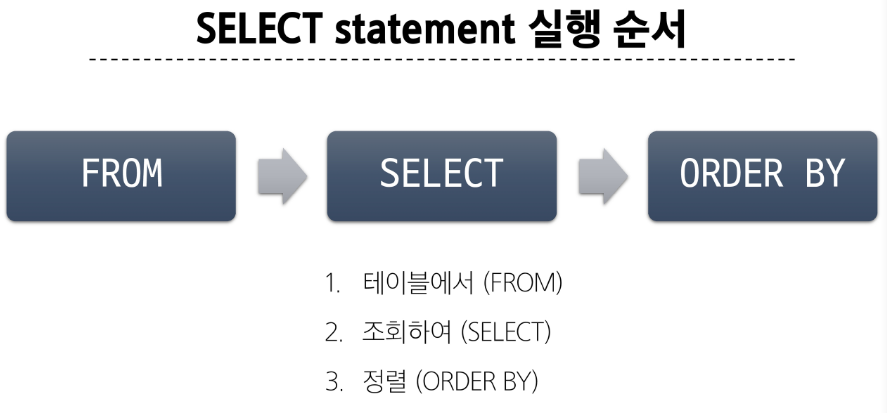
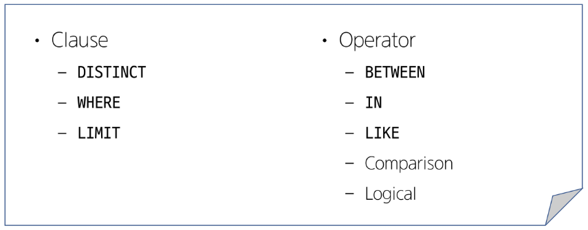
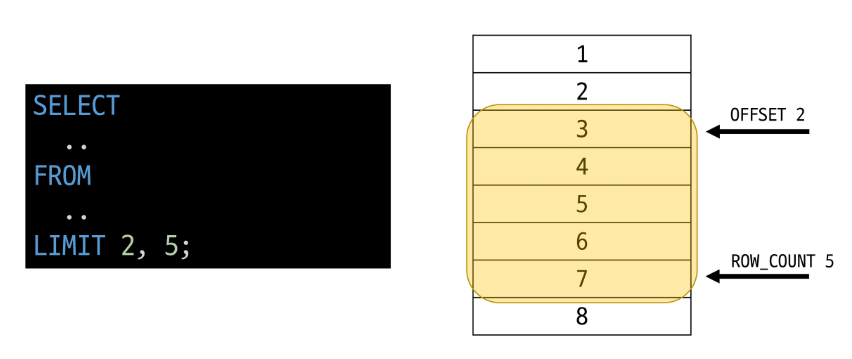
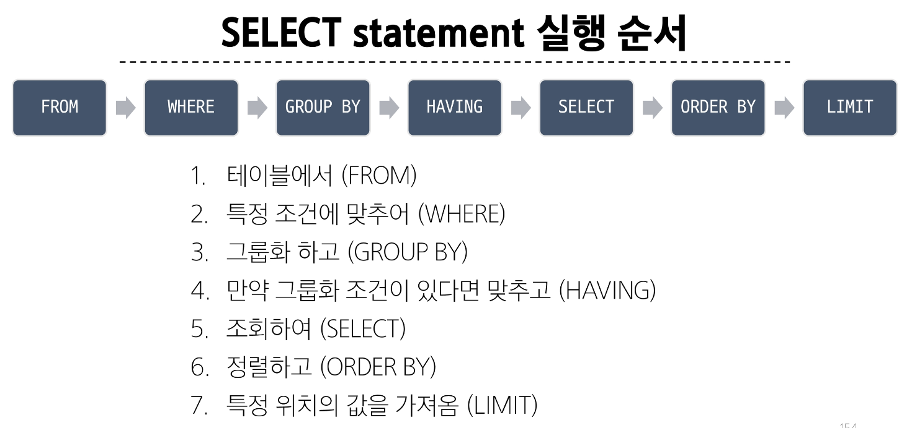

# Relational Database 관계형 데이터베이스
- 테이블, 헹, 열의 정보를 구조화하는 방식
- 서로 관련된 데이터 포인터를 저장하고 이에 대한 액세스를 제공

### 관계: 여러 테이블 간의 (논리적) 연결
#### 관계형 데이터베이스 예시
- 이 관계로 인해 두 테이블을 사용하여 데이터를 다양한 형식으로 조회할 수 있음
  - 특정 날짜에 구매한 모든 고객 조회
  - 지난 달에 배송일이 지연된 고객 조회 등
- 고객 데이터 간 비교를 위해서는 각 데이터에 고유한 식별값을 부여해 그 값을 활용해야 한다. >> 기본 키, Primary Key
- 누가 어떤 주문을 했는지 주문 정보에 고객의 고유한 식별 값을 저장해야 한다. >> 외래 키, Foreign Key

## 관계형 데이터베이스 관련 키워드
1. Table (= Relation): 데이터를 기록하는 곳
2. Field (= Column, Attribute): 각 필드에는 고유한 데이터 형식(타입)이 지정됨
3. Record (= Row, Tuple): 각 레코드에는 구체적인 데이터 값이 저장됨
4. Database (= Schema): 테이블의 집합
5. Primary Key (= 기본 키, PK): 각 레코드의 고유한 값, 관계형 데이터베이스에서 레코드의 식별자로 활용
6. Foreign Key (= 외래 키, FK): 테이블의 필드 중 다른 테이블의 레코드를 식별할 수 있는 키, 다른 테이블의 기본 키를 참조, 각 레코드에서 서로 다른 테이블 간의 관계를 만드는 데 사용

---
---
# RDBMS
#### DBMS: 데이터베이스를 관리하는 소프트웨어 프로그램
- Database Management System
- 데이터 저장 및 관리를 용이하게 하는 시스템
- 데이터베이스와 사용자 간의 인터페이스 역할
- 사용자가 데이터 구성, 업데이트, 모니터링, 백업, 복구 등을 할 수 있도록 도움

#### RDBMS: 관계형 데이터베이스를 관리하는 소프트웨어 프로그램
- Relational Database Management System
- 종류: SQLite, MySQL, Oracle Database, ...

---
---
# SQL (Structure Query Language)
- 데이터베이스에 정보를 저장하고 처리하기 위한 프로그래밍 언어
- 테이블의 형태로 구조화된 관계형 데이터베이스에게 요청을 질의(요청)

## SQL Syntax
> SELECT column_name FROM table_name;
1. SQL 키워드는 대소문자를 구분하지 않음
   - 하지만 대문자로 작성하는 것을 권장 (명시적 구분)
2. 각 SQL Statements의 끝에는 세미콜론(;)이 필요
   - 세미콜론은 각 SQL Statements을 구분하는 방법 (명령어의 마침표)

## SQL Statements
SQL을 구성하는 가장 기본적인 코드 블록
> SELECT column_name FROM table_name;
- 해당 예시 코드는 SELECT Statement라 부름
- 이 Statement는 SELECT, FROM 2개의 keyword로 구성 됨

#### 수행 목적에 따른 SQL Statements 4가지 유형
1. DDL - 데이터 정의
2. DQL - 데이터 검색
3. DML - 데이터 조작
4. DCL - 데이터 제어



# Query
- 데이터베이스로부터 정보를 요청하는 것
- 일반적으로 SQL로 작성하는 코드를 쿼리문(SQL문)이라 함

---
---
# Querying data
## SELECT
- 테이블에서 데이터를 조회

### SELECT syntax
```
SELECT
  select_list AS '###'
FROM
  table_name;
```
- SELECT 키워드 이후 데이터를 선택하려는 필드를 하나 이상 지정
- FROM 키워드 이후 데이터를 선택하려는 테이블의 이름을 지정
- AS 이후 내용으로 출력 될 수 있도록 변경 (없어도 됨)
- 'SELECT *'를 사용하여 모든 필드 선택 가능

# Sorting data
## ORDER BY
- 조회 결과의 레코드를 정렬

### ORDER BY syntax
```
SELECT
  select_list
FROM
  table_name;
ORDER BY
  column1 [ASC|DESC],
  ...;
```
- FROM clause 뒤에 위치
- 하나 이상의 컬럼을 기준으로 결과를 오름차순(ASC, 기본 값), 내림차순(DESC)으로 정렬
- 내림차순 예시: `ORDER BY FirstName DESC, City;` = FirstName 내림차순으로 정리 후, City 오름차순으로 정리
- NULL 값이 존재할 경우 오름차순 정렬 시 결과에 NULL이 먼저 출력

## SELECT statement 실행 순서


# Filtering data
## Filtering data 관련 Keywords


### 1. DISTINCT 
- 조회 결과에서 중복된 레코드를 제거
```
SELECT DISTINCT
  select_list
FROM
  table_name;
```
- SELECT 키워드 바로 뒤에 작성해야 함
- SELECT DISTINCT 키워드 다음에 고유한 값을 선택하려는 하나 이상의 필드를 지정

### 2. WHERE 
- 조회 시 특정 검색 조건을 지정
```
SELECT
  select_list
FROM
  table_name
WHERE
  search_condition;
```
- FROM clause 뒤에 위치
- search_condition은 비교연산자 및 논리연산자(AND, OR, NOT 등)를 사용하는 구문이 사용됨
- 활용 예시: SQL1 p.106~

# Operators
### Comparison Operators(비교 연산자)
`=`, `>=`, `<=`, `IS`, `LIKE`, `IN`, `BETWEEN...AND`

### Logicla Operators(논리 연산자)
`AND(&&)`, `OR(||)`, `NOT(!)`

### IN Operator
값이 특정 목록 안에 있는지 확인

### LIKE Operator
값이 특정 패턴에 일치하는지 확인(Wildcards와 함께 사용)

### Wildcard Characters
`%`: 0개 이상의 문자열과 일치하는지 확인, `_`: 단일 문자와 일치하는지 확인

---
---
## LIMIT
- 조회하는 레코드 수를 제한
```
SELECT
  select_list
FROM
  table_name
LIMIT [offset,] row_count;
```
- 하나 또는 두 개의 인자를 사용 (0 또는 양의 정수)
- row_count는 조회하는 최대 레코드 수를 지정

- 

## GROUP BY
- 레코드를 그룹화하여 요약본 생성 ('집계 함수'와 함께 사용)

### Aggregation Functions(집계 함수)
- 값에 대한 계산을 수행하고 단일한 값을 반환하는 함수
- `SUM`, `AVG`, `MAX`, `MIN`, `COUNT`

```
SELECT
  c1, c2, ..., cn, aggregate_function(ci)
FROM
  table_name
GROUP BY
  c1, c2, ..., cn;
```
- FROM 및 WHERE 절 뒤에 배치
- GROUP BY 절 뒤에 그룹화 할 필드 목록을 작성

1. Country 필드를 그룹화
2. COUNT 함수가 각 그룹에 대한 집계된 값을 계산

- 활용 예시: SQL1 p.148~

## SELECT 정리


---
---
# CREATE TABLE
- 테이블 생성
```
CREATE TABLE table_name (
  column_1 data_type constraints,
  column_2 data_type constraints,
  ...,
)
```
- 각 필드에 적용할 데이터 타입 작성
- 테이블 및 필드에 대한 제약조건(constraints) 작성

### PRAGMA
- 테이블 schema(구조) 확인
- `PRAGMA table_info('examples');`
  - 'cid'
    - Column ID 를 의미하며 각 컬럼의 고유한 식별자를 나타내는 정수 값
    - 직접 사용하지 않으며 PRAGMA 명령과 같은 메타데이터 조회에서 출력 값으로 활용됨

### CREATE 예시
```
CREATE TABLE examples (
  ExamID INTEGER PRIMARY KEY AUTOINCREMENT,
  LastName VARCHAR(50) NOT NULL,
  FirstName VARCHAR(50) NOT NULL
);
```
- `INTEGER`: 데이터 타입
- `NOT NULL`, `PRIMARY KEY`: 제약 조건
- `AUTOINCREMENT`: AUTOINCREMENT 키워드

### SQLite 데이터 타입
1. NULL: 아무런 값도 포함하지 않음을 나타냄
2. INTEGER: 정수
3. REAL: 부동 소수점
4. TEXT: 문자열
5. BLOB: 이미지, 동영상, 문서 등의 바이너리 데이터

## Constraints(제약 조건)
- 테이블의 필드에 적용되는 규칙 또는 제한 사항
- 데이터의 무결성을 유지하고 데이터베이스의 일관성을 보장

### 대표 제약 조건 3가지
- PRIMARY KEY
  - 해당 필드를 기본 키로 지정
  - INTEGER 타입에만 적용되며 INT, BIGINT 등과 같은 다른 정수 유형은 적용되지 않음
- NOT NULL
  - 해당 필드에 NULL 값을 허용하지 않도록 지정
- FOREIGN KEY
  - 다른 테이블과의 외래 키 관계를 정의

#### AUTOINCREMENT keyword: 자동으로 고유한 정수 값을 생성하고 할당하는 필드 속성
- 필드의 자동 증가를 나타내는 특수한 키워드
- 주로 primary key 필드에 적용
- INTEGER PRIMARY KEY AUTOINCREMENT 가 작성된 필드는 항상 새로운 레코드에 대해 이전 최대 값보다 큰 값을 할당
- 삭제된 값은 무시되며 재사용할 수 없게 됨

# ALTER TABLE
- 테이블 및 필드 조작

### 역할
1. `ALTER TALBE ADD COLUMN`: 필드 추가
   - `ADD COLUMN` 키워드 이후 추가하고자 하는 새 픽ㄹ드 이름과 데이터 타입 및 제약 조건 작성
   - 단, 추가하고자 하는 필드에 NOT NULL 제약 조건이 있을 경우 NULL이 아닌 기본 값 설정 필요
   - 테이블 생성시 정의한 필드는 기본 값이 없어도 NOT NULL 제약조건으로 생성되며 내부적으로 Default value는 NULL로 설정됨
   - SQLite는 단일 문을 사용하여 한번에 여러 필드를 추가할 수 없음

2. `ALTER TABLE RENAME COLUMN`: 필드 이름 변경
   - `RENAME COLUMN` 키워드 뒤에 이름을 바꾸려는 필드의 이름을 지정하고 `TO` 키워드 뒤에 새 이름을 지정

3. `ALTER TABLE RENAME TO`: 테이블 이름 변경
   - `RENAME TO` 키워드 뒤에 새로운 테이블 이름 지정

# DROP TABLE
- 테이블 삭제
`DROP TABLE table_name;`
- DROP TABLE statement 이후 삭제할 테이블 이름 작성

# 타입 선호도 (Type Affinity)
- 컬럼에 데이터 타입이 명시적으로 지정되지 않았거나 지원하지 않을 때 SQLite가 자동으로 데이터 타입을 추론하는 것

1. 유연한 데이터 타입 지원
   - 데이터 타입을 명시적으로 지정하지 않고도 데이터를 저장하고 조회할 수 있음
   - 컬럼에 저장되는 값의 특성을 기반으로 데이터 타입을 유추
2. 간편한 데이터 처리
   - INTEGER Type Affinity를 가진 열에 문자열 데이터를 저장해도 SQLite는 자동으로 숫자로 변환하여 처리
3. SQL 호환성
   - 다른 데이터베이스 시스템과 호환성을 유지

---
---
# INSERT
- 테이블 레코드 삽입
```
INSERT INTO table_name (c1, c2, ...)
VALUES (v1, v2, ...);
```
- INSERT INTO 절 다음에 테이블 이름과 괄호 안에 필드 목록 작성
- VALUES 키워드 다음 괄호 안에 해당필드에 삽입할 값 목록 작성

# UPDATE
- 테이블 레코드 수정
```
UPDATE table_name
SET column_name = expression,
[WHERE
  condition];
```
- SET 절 다음에 수정 할 필드와 새 값을 지정
- WHERE 절에서 수정 할 레코드를 지정하는 조건 작성
- WHERE 절을 작성하지 않으면 모든 레코드를 수정

# DELETE
- 테이블 레코드 삭제
```
DELETE FROM table_name
[WHERE
  condition];
```
- DELETE FROM 절 다음에 테이블 이름 작성
- WHERE 절에서 삭제할 레코드를 지정하는 조건 작성
- WHERE 절을 작성하지 않으면 모든 레코드를 삭제

### SQLite의 날짜와 시간은 공식 문서 확인

---
---
# Join
### JOIN이 필요한 순간
> 테이블을 분리하면 데이터 관리는 용이해질 수 있으나 출력시에는 문제가 있음
> 
> 테이블 한 개 만을 출력할 수 밖에 없어 다른 테이블과 결합하여 출력하는 것이 필요해짐
>
> 이때 사용 하는 것이 'JOIN'

### JOIN
둘 이상의 테이블에서 데이터를 검색하는 방법

#### 1. INNER JOIN
- 두 테이블에서 값이 일치하는 레코드에 대해서만 결과를 반환
```
SELECT
  select_list
FROM
  table_a
INNER JOIN table_b
  ON table_b.fk = table_a.pk;
```
- FROM 절 이후 메인 테이블 지정 (table_a)
- INNER JOIN 절 이후 메인 테이블과 조인할 테이블을 지정 (table_b)
- ON 키워드 이후 조인 조건을 작성
- 조인 조건은 table_a와 table_b 간의 레코드를 일치시키는 규칙을 지정

#### 2. LEFT JOIN
- 오른쪽 테이블의 일치하는 레코드와 함께 왼쪽 테이블의 모든 레코드 반환
```
SELECT
  select_list
FROM
  table_a
LEFT JOIN table_b
  ON table_b.fk = table_a.pk;
```
- FROM 절 이후 왼쪽 테이블 지정 (table_a)
- LEFT JOIN 절 이후 오른쪽 테이블 지정 (table_b)
- ON 키워드 이후 조인 조건을 작성
  - 왼쪽 테이블의 각 레코드를 오른쪽 테이블의 모든 레코드와 일치시킴
- LEFT JOIN 특징
  - 왼쪽 테이블의 모든 레코드를 표기
  - 오른쪽 테이블과 매칭되는 레코드가 없으면 NULL을 표시


