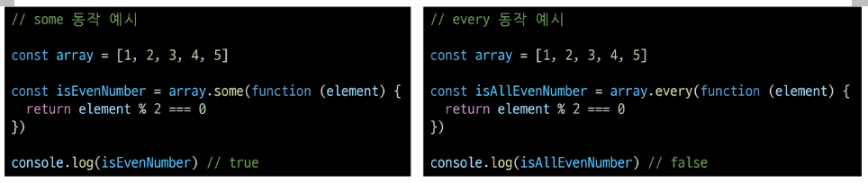

# 함수
- '선언식' 사용보다 '표현식' 사용을 권장

```js
// 선언식

add (1, 2) // 3

function add (num1, num2) {
  return num1+num2
}
```

```js
// 표현식

const sub = function(num1, num2) {
  return num1 - num2
}

sub(2, 1) // 3
```

## 매개변수
1. 기본 함수 매개 변수
```js
const greeting = function (name='Anonymous'){
  return `Hi ${name}`
}

greeting() // Hi Anonymous
```
2. 나머지 매개변수
   - 함수 당 하나만 작성 가능
   - 마지막에 위치해야 함
```js
const myFunc = function(param1, param2, ...restParams){
  return [param1, param2, restParams]
}

myFunc(1, 2, 3, 4, 5) // [1, 2, [3, 4, 5]]
myFunc(1, 2) // [1, 2, []]
```
3. 매개 변수와 인자 개수가 불일치 할 때
   1. 매개변수 개수 > 인자 개수: 누락된 인자는 `undefined`로 할당
   2. 매개변수 개수 < 인자 개수: 초과 입력한 인자는 사용하지 않음

## 전개 구문
### 전개 구문 활용처
1. 함수와의 사용
   1. 함수 호출 시 인자 확장

```js
function myFunc(x, y, z){
  return x+y+z
}

let numbers = [1, 2, 3]

console.log(myFunc(...numbers)) // 6
```
   2. 나머지 매개변수 (압축)

```js
funcion myFunc2(x, y, ...restArgs) {
  return [x, y, restArgs]
}

console.log(myFunc2(1, 2, 3, 4, 5)) // [1, 2, [3, 4, 5]]
console.log(myFunc2(1, 2)) // [1, 2, []]
```
2. 객체와의 사용
3. 배열과의 사용

## 화살표 함수
1. funcion 키워드 제거 후 매개변수의 중괄호 사이에 화살표 (=>) 작성
2. 함수의 매개변수가 하나 뿐이라면, 매개변수의 '()' 제거 가능 (단, 생략하지 않는 것을 권장)
3. 함수 본문의 표현식이 한 줄이라면, '{}'와 'return' 제거 가능
```js
const arrow1 = function(name){
  return `hello ${name}`
}

const arrow2 = (name) => {return `hello ${name}`}
const arrow3 = name => {return `hello ${name}`}
const arrow4 = name => `hello ${name}`
```

# 객체

### 객체 구조
- 중괄호 '{}'를 이용해 작성
- 중괄호 안에는 key:value 쌍으로 구성된 속성을 여러개 작성 가능
- key는 문자형만 허용
- value는 모든 자료형 허용

### 속성 참조
- 점'.' 또는 대괄호'[]'로 객체 요소 접근
- key 이름에 띄어쓰기 같은 구분자가 있으면 대괄호 접근만 가능

### in 연산자
- 속성이 객체에 존재하는지 여부를 확인
- `console.log('greeting' in user)`

### Method
- object.method() 방식으로 호출
- 매서드는 객체를 '행동'할 수 있게 함
- `console.log(user.greeting()) // hello`

## this
```js
const person = {
  name: 'Alice',
  greeting : function(){
    return `Hello my name is ${this.name}`
  },
}

console.log(person.greeting()) // Hello my name is Alice
```
1. 단순 호출 시 this: 가리키는 대상 => 전역 객체
```js
const myFunc = function(){
  return this
}

console.log(myFunc()) // window
```
2. 매서드 호출 시 this: 가리키는 대상 => 메서드를 호출한 객체
```js
const myObj = {
  data : 1,
  myFunc: function(){
    return this
  }
}

console.log(myObj.myFunc()) // myObj
```

### 화살표 함수는 자신만의 this를 가지지 않기 때문에 외부 함수에서의 this 값을 가져옴
```js
const myObj3 = {
  numbers: [1, 2, 3],
  myFunc : function () {
    this.numbers.forEach((number) => {
      console.log(this) // myObj3
    })
  }
}

console.log(myObj.myFunc())
```

## 추가 객체 문법
1. 단축 속성: 키 이름과 값으로 쓰이는 변수의 이름이 같은 경우 단축 구문을 사용할 수 있음
```js
const name = 'Alice'
const age = 30

const user = {
  name, age,
}
```
2. 단축 메서드 : 메서드 선언 시 function 키워드 생략 가능
```js
const myObj2 = {
  myFunc() {
    return 'Hello'
  }
}
```
3. 계산된 속성 : 키가 대괄호로 둘러 싸여있는 속성(고정된 값이 아닌 변수 값을 사용할 수 있음)
```js
const product = prompt('물건')
const prefix = 'my'
const suffix = 'property'

const bag = {
  [product] : 5,
  [prefix + suffix] : 'value',
}

console.log(bag) // {연필: 5, myproperty: 'value'}
```
4. 구조 분해 할당: 배열 또는 객체를 분해하여 객체 속성을 변수에 쉽게 할당할 수 있는 문법
```js
const person = {
  name: 'Bob',
  age: 35,
  city: 'London',
}

function printInfo({name, age, city}) {
  console.log(`이름: ${name}, 나이: ${age}, 도시: ${city}`)
}

printInfo(person) // 이름 : Bob, 나이 : 35, 도시 : London
```
5. Object with '전개 구문': 객체 복사(얕은 복사)
```js
const obj = {b:2, c:3, d:4}
const newObj = {a:1, ...obj, e:5}

console.log(newObj) // {a:1, b:2, c:3, d:4, e:5}
```
6. 유용한 객체 메서드
```js
const profile = {
  name: 'Alice',
  age: 30,
}

console.log(Object.keys(profile)) // ['name', 'age']
console.log(Object.values(profile)) // ['Alice', 30]
```
7. Optional chaining ('?.')
   - 중첩 객체 접근(에러 대신 undefined 반환)
```js
const user = {
  name: 'Alice',
  greeting:function() {
    return 'hello'
  }
}

console.log(user.address.street) // Uncaught TypeError
console.log(user.address?.street) // undefined
console.log(user.address && user.address.street) // && 연산자를 사용해도 undefinde가 반환된다.
```
     - 존재하지 않아도 괜찮은 대상에만 사용해야 함
     - 앞의 변수는 반드시 선언되어 있어야 함
     
     정리
     1. obj?.prop: obj가 존재하면 obj.prop을 반환하고, 그렇지 않으면 undefined를 반환
     2. obj?.[prop]: obj가 존재하면 obj[prop]을 반환하고, 그렇지 않으면 undefined를 반환
     3. obj?.method(): obj가 존재하면 obj.method()를 호출하고, 그렇지 않으면 undefined를 반환

### JSON
```js
// Object -> JSON
const objToJson = JSON.stringify(jsObject)

// JSON -> Object
const jsonToObj = JSON.parse(objToJson)
```

## new
- 사용자 정의 객체 타입을 생성
```js
function Member(name, age, sId) {
  this.name = name
  this.age = age
  this.sId = sId
}

const member3 = new Member('Bella', 21, 20226543)
```

# 배열

## 배열 구조
- 대괄호 '[]'를 이용해 작성
- 요소 자료형: 제약 없음
- lenght 속성을 사용해 배열에 담긴 요소가 몇 개인지 알 수 있음

## 주요 메서드
1. push: 배열 끝 요소를 추가
2. pop: 배열 끝 요소를 제거(반환)
3. unshift: 배열 앞 요소를 추가
4. shift: 배열 앞 요소를 제거(반환)

## Array Helper Methods
### 콜백 함수
- 다른 함수에 인자로 전달되는 함수
- 외부 함수 내에서 호출되어 일종의 루틴이나 특정 작업을 진행
```js
const numbers1 = [1, 2, 3]

const callBackFunction = function(num){
  console.log(num**2)
}
numbers1.forEach(callBackFunction)
```

### Array Helper Methods
1. forEach
   - 배열 내의 모든 요소 각각에 대해 함수를 호출
   - 반환 값 없음
   - `arr.forEach(callback(item[, index[, array]]))`
```js
const names = ['Alice', 'Bella', 'Cathy']

// 일반 함수 표기
names.forEach(function (name) {
  console.log(name)
})

// 화살표 함수 표기
names.forEach((names) => {
  console.log(name)
})

names.forEach(functions (name, index, array) {
  console.log(`${name} / ${index} / ${array}`)
})
```


2. map
   - 배열 내의 모든 요소 각각에 대해 함수를 호출
   - 함수 호출 결과를 모아 새로운 배열을 반환
   - `arr.map(callback(item[, index[, array]]))`
```js
// 배열을 순회하며 각 객체의 name 속성 값을 추출하기
const people = [
  {name: 'Alice', age:20},
  {name: 'Bella', age:21}
]

// for...of
let result1 = []
for (const person of people) { 
  result1.push(person.name)
}
console.log(result1)

// map()
const result2 = people.map(function(person) {
  return person.name
})
console.log(result2)
```

### 배열 순회 종합
1. for loop
   - 배열의 인덱스를 이용하여 각 요소에 접근
   - break, continue 사용 가능
2. for ... of
   - 배열 요소에 바로 접근 가능
   - break, continue 사용 가능
3. forEach
   - 간결하고 가독성이 높음
   - callback 함수를 이용하여 각 요소를 조작하기 용이
   - break, continue 사용 불가능
   - 대신 some과 every의 특징을 활용할 수 있음(some은 true, every는 false를 반환하면 즉시 순회 중단)
   - 
   - 사용 권장

### 기타 Array Helper Methods
- filter: 콜백 함수의 반환 값이 참인 요소만 모아서 새로운 배열을 반환
- find: 콜백 함수의 반환 값이 참이면 해당 요소를 반환
- some: 배열의 요소 중 적어도 하나라도 콜백 함수를 통과하면 true를 반환하며 즉시 배열 순회 중지, 반면에 모두 통과하지 못하면 false를 반환
- every: 배열의 모든 요소가 콜백 함수를 통과하면 true를 반환, 반면에 하나라도 통과하지 못하면 즉시 false를 반환하고 배열 순회 중지