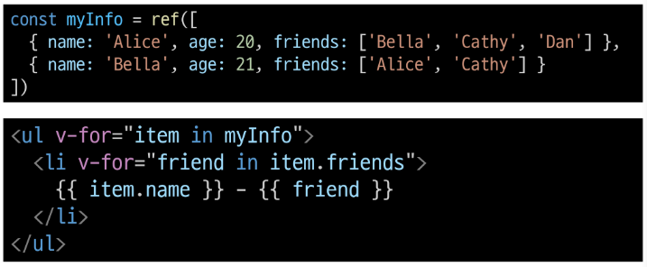
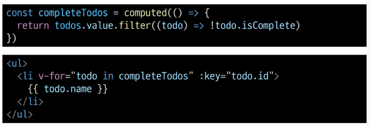
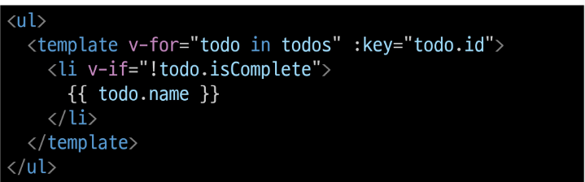
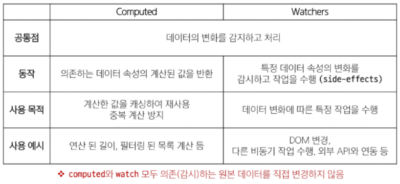
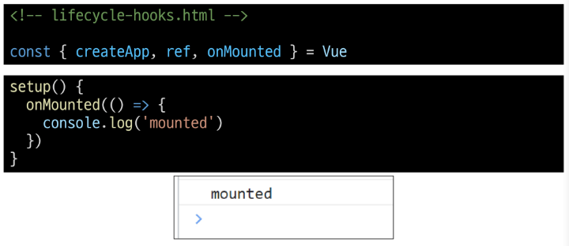
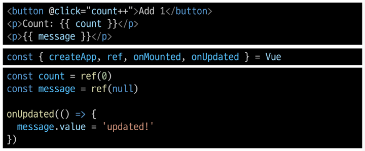

# Computed Properties

## computed()
- '계산된 속성'을 정의하는 함수
- 미리 계산된 속성을 사용하여 템플릿에서 표현식을 단순하게 하고 불필요한 반복 연산을 줄임

### 특징
- 반환되는 값은 computed ref이며 일반 refs와 유사하게 계산된 결과를 .value로 참조할 수 있음(템플릿에서는 .value 생략 가능)
- computed 속성은 의존된 반응형 데이터를 자동으로 추적
- 의존하는 데이터가 변경될 때만 재평가(업데이트)

### computed와 method 차이
- computed 속성은 의존형 반응형 데이터를 기반으로 캐시(cached)된다
- 의존하는 데이터가 변경된 경우에만 재평가됨
- 즉, 의존된 반응형 데이터가 변경되지 않는 한 이미 계산된 결과에 대한 여러 참조는 다시 평가할 필요 없이 이전에 계산된 결과를 즉시 반환
- 반면 method 호출은 다시 렌더링이 발생할 때마다 항상 함수를 실행

### cache(캐시)
- 데이터나 결과를 일시적으로 저장해두는 임시 저장소
- 이후에 같은 데이터나 결과를 다시 계산하지 않고 빠르게 접근할 수 있도록 함

### computed와 method의 적절한 사용처
1. computed
   - 의존하는 데이터에 따라 결과가 바뀌는 계산된 속성을 만들 때 유용
   - 동일한 의존성을 가진 여러 곳에서 사용할 때 계산 결과를 캐싱하여 중복 계산 방지

2. method
   - 단순히 특정 동작을 수행하는 함수를 정의할 때 사용
   - 데이터에 의존하는지 여부와 관계없이 항상 동일한 결과를 반환하는 함수

### method와 computed 정리
1. computed
   - 의존된 데이터가 변경되면 자동으로 업데이트

2. method
   - 호출해야만 실행됨

#### 무조건 computed만 사용하는 것이 아니라 사용 목적과 상황에 맞게 computed와 method를 적절히 조합하여 사용

# Conditional Rendering
## v-if
표현식 값의 true/false를 기반으로 요소를 조건부로 렌더링

### 여러 요소에 대한 v-if 적용
- HTML template 요소에 v-if를 사용하여 하나 이상의 요소에 대해 적용할 수 있음
- v-else, v-else-if 모두 적용 가능
- HTML `<template>` element: 페이지가 로드될 때 렌더링 되지 않지만 Javascript를 사용하여 나중에 문서에서 사용할 수 있도록 하는 HTML을 보유하기 위한 메커니즘 (보이지 않는 wrapper 역할)

## v-show
표현식 값의 true/false를 기반으로 요소의 가시성을 전환
(항상 DOM에 렌더링 되어 있고 display 속성만 none으로 전환)

## v-if와 v-show의 적절한 사용처
1. v-if (Cheap initial load, expensive toggle)
   - 초기 조건이 false인 경우 아무 작업도 수행하지 않음
   - 토글 비용이 높음

2. v-show (Expensive inital load, cheap toggle)
   - 초기 조건에 관계 없이 항상 렌더링
   - 초기 렌더링 비용이 더 높음

#### 콘텐츠를 매우 자주 전환해야 하는 경우에는 v-show를, 실행 중에 조건이 변경되지 않는 경우에는 v-if를 권장

# List Rendering
## v-for
소스 데이터(Array, Object, Number, String, Iterable)를 기반으로 요소 또는 템플릿 블록을 여러번 렌더링

### v-for 구조
- v-for는 `alias in expression` 형식의 특수 구문을 사용
- 인덱스(객체에서는 key)에 대한 별칭을 지정할 수 있음

### 여러 요소에 대한 v-for 적용
- HTML template 요소에 v-for 를 사용하여 하나 이상의 요소에 대해 반복 렌더링 할 수 있음

### 중첩된 v-for
- 각 v-for 범위는 상위 범위에 접근할 수 있음


# v-for with key

## 반드시 v-for와 key를 함께 사용한다.
- 내부 컴포넌트의 상태를 일관되게 하여 데이터의 예측 가능한 행동을 유지하기 위함
- key는 반드시 각 요소에 대한 고유한 값을 나타낼 수 있는 식별자여야 함

## 내장 특수 속성 key
- number 혹은 string으로만 사용해야 함
- Vue의 내부 가상 DOM 알고리즘이 이전 목록과 새 노드 목록을 비교할 때 각 node를 식별하는 용도로 사용
- Vue 내부 동작 관련된 부분이기에 최대한 작성하려고 노력할 것

# v-for with v-if

## 동일 요소에 v-for와 v-if를 함께 사용하지 않는다.
- 동일한 요소에서 v-if가 v-for보다 우선순위가 더 높기 때문
- v-if 에서의 조건은 v-for 범위의 변수에 접근할 수 없음

## v-for와 v-if 해결법 2가지
1. `computed`를 활용해 필터링 된 목록을 반환하여 반복하도록 설정

2. v-for 와 `<template>` 요소를 사용하여 v-if 위치를 이동


# Watchers
## watch()
하나 이상의 반응형 데이터를 감시하고, 감시하는 데이터가 변경되면 콜백 함수를 호출

### watch 구조
```js
watch(source, (newValue, oldValue) => {
  // do something
})
```
1. `source`: watch 가 감시하는 대상 (반응형 변수, 값을 반환하는 함수 등)
2. `callback function`: source가 변경될 때 호출되는 콜백 함수
   1. `newValue`: 감시하는 대상이 변화된 값
   2. `oldValue`: 감시하는 대상의 기존 값

### 여러 source를 감시하는 watch: 배열을 활용


## computed vs. watch


# Lifecycle Hooks
Vue 인스턴스의 생애주기 동안 특정 시점에 실행되는 함수

## Lifecycle Hooks Diagram
- 인스턴스의 생애 주기 중간 중간에 함수를 제공하여 개발자가 특정 단계에서 원하는 로직을 작성할 수 있도록 함

### 예시
1. Vue 컴포넌트 인스턴스가 초기 렌더링 및 DOM 요소 생성이 완료된 후 특정 로직을 수행하기

2. 반응형 데이터의 변경으로 인해 컴포넌트의 DOM이 업데이트된 후 특정 로직을 수행하기


## Lifecycle Hooks 특징
- Vue는 Lifecycle Hooks에 등록된 콜백 함수들을 인스턴스와 자동으로 연결함
- 이렇게 동작하려면 hooks 함수들은 반드시 동기적으로 작성되어야 함
- 인스턴스 생에 주기의 여러 단계에서 호출되는 다른 hooks도 있으며, 가장 일반적으로 사용되는 것은  onMounted, onUpdated, onUnmounted

# Vue Style Guide

## 규칙 범주
- 우선순위 A: 필수 (Essential)
  - 오류를 방지하는 데 도움이 되므로 어떤 경우에도 규칙을 학습하고 준수
- 우선순위 B: 적극 권장 (Strongly Recommended)
  - 가독성 및 개발자 경험을 향상시킴
  - 규칙을 어겨도 코드는 여전히 실행되겠지만, 정당한 사유가 있어야 규칙을 위반할 수 있음
- 우선순위 C: 권장 (Recommended)
  - 일관성을 보장하도록 임의의 선택을 할 수 있음
- 우선순위 D: 주의 필요 (Use with Caution)
  - 잠재적 위험 특성을 고려함

# computed 주의사항
## computed의 반환 값은 변경하지 말 것
- computed의 반환 값은 의존하는 데이터의 파생된 값
  - 이미 의존하는 데이터에 의해 계산이 완료된 값
- 일종의 snapshot이며 의존하는 데이터가 변경될 때만 새 snapshot이 생성됨
- 계산된 값은 읽기 전용으로 취급되어야 하며 변경되어서는 안됨
- 대신 새 값을 얻기 위해서는 의존하는 데이터를 업데이트 해야 함
- computed에서 reverse() 및 sort() 사용시 원본 배열을 변경하기 때문에 원본 배열의 복사본을 만들어서 진행해야 함

# 배열과 v-for 관련
## 배열 변경 관련 메서드
- v-for와 배열을 함께 사용 시 배열의 메서드를 주의해서 사용해야 함

1. 변화 메서드
   - 호출하는 원본 배열을 변경
   - push(), pop(), shift(), unshift(), splice(), sort(), reverse()
2. 배열 교체
   - 원본 배열을 수정하지 않고 항상 새 배열을 반환
   - filter(), concat(), slice()

## v-for와 배열을 활용해 '필터링/정렬' 활용하기
- 원본 데이터를 수정하거나 교체하지 않고 필터링하거나 정렬된 새로운 데이터를 표시하는 방법
1. computed 활용
   - 원본 기반으로 필터링 된 새로운 결과를 생성
2. method 활용 (computed가 불가능한 중첩된 v-for에 경우 사용)

## 배열의 인덱스를 v-for의 key로 사용하지 말 것
- 인덱스는 식별자가 아닌 배열의 항목 위치만 나타내기 때문
- 만약 새 요소가 배열의 끝이 아닌 위치 삽입되면 이미 반복된 구성 요소 데이터가 함께 업데이트 되지 않기 때문
- 직접 고유한 값을 만들어내는 메서드를 만들거나 외부 라이브러리 등을 활용하는 등 식별자 역할을 할 수 있는 값을 만들어 사용