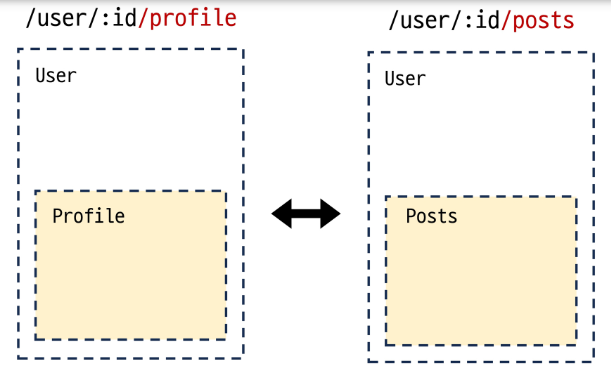
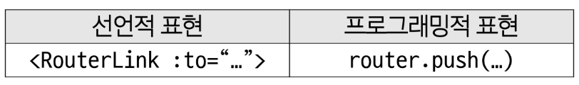
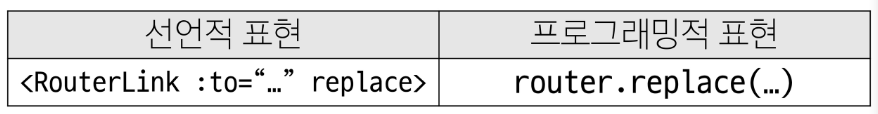
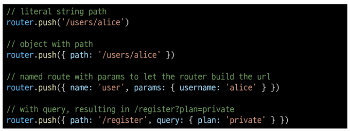

# Routing
- 네트워크에서 경로를 선택하는 프로세스
- 웹 애플리케이션에서 다른 페이지 간의 전환과 경로를 관리하는 기술

### SSR과 CSR에서 라우팅이 다름
- SSR은 routing을 서버측에서 수행(사용자 URL을 기반으로 응답 전송)
- CSR은 routing을 클라이언트 측에서 수행

### SPA에서 Routing이 없다면
- URL이 1개이기 때문에 주소에 따라 렌더링 할 수 없음
- 주소에 따라 여러 컴포넌트를 새로 렌더링하여야 함

## Nested Routes (중첩된 라우팅)

> 컴포넌트 간 부모-자식 관계 관점이 아닌 URL에서의 중첩된 관계를 표현하는 관점으로 바라보기

## Programmatic Navigation (프로그래밍 방식 네비게이션)
- RouterLink 대신 JavaScript를 사용해 페이지를 이동하는 것
- 프로그래밍으로 URL 이동하기
- router의 인스턴스 메서드를 사용해 RouterLink로 `<a>` 태그를 만드는 것처럼 프로그래밍으로 네비게이션 관련 작업을 수행할 수 있음

### router의 메서드
1. 다른 위치로 이동하기: `router.push()`

   - history stack에 새 항목을 push함 > 뒤로가기 사용 가능

2. 현재 위치 바꾸기: `router.replace()`

   - 이동만 함

#### params 인자 활용


## Navigation Guard
- Vue router를 통해 특정 URL에 접근할 때 다른 URL로 redirect를 하거나 취소하여 내비게이션을 보호
- 라우트 전환 전/후 자동으로 실행되는 Hook

1. Globally(전역 가드): 애플리케이션 전역에서 모든 라우트 전환에 적용되는 가드
2. Per-route(라우터 가드): 특정 라우트에만 적용되는 가드
3. In-component(컴포넌트 가드): 컴포넌트 내에서만 적용되는 가드

### 1. Globally Guard
- `index.js`에 작성
- `router.beforeEach()`: 다른 URL로 이동하기 직전에 실행되는 함수
```js
router.beforeEach((to, from) => {
  ...
  return false 또는 return { name: 'About' }
})
```
  - 모든 가드는 2개의 인자를 받음
    - `to`: 이동 할 URL 정보가 담긴 Route 객체
    - `from`: 현재 URL 정보가 담긴 Route 객체
  - 선택적으로 다음 값 중 하나를 반환
    1.  `false`
        - 현재 내비게이션을 취소
        - 브라우저 URL이 변경된 경우 'from' 경로의 URL로 재설정
    2.  `Route Location`
        - `router.push()`를 호출하는 것처럼 경로 위치를 전달하여 다른 위치로 redirect
        - return이 없다면 자동으로 `to` URL Route 객체로 이동

### 2. Per-route Guard
- `index.js`의 각 routes에 작성
- `router.beforeEnter()`: 특정 route에 진입했을 때만 실행되는 함수
  - 단순히 URL의 매개변수나 쿼리 값이 변경될 때는 실행되지 않고, 다른 URL에서 탐색해 올 때만 실행됨

### 3. In-component Guard
- 각 컴포넌트의 `<script>` 내부에 작성
1. `onBeforeRouteLeave()`
   - 현재 라우트에서 다른 라우트로 이동하기 전에 실행
   - 사용자가 현재 페이지를 떠나는 동작에 대한 로직을 처리
2. `onBeforeRouteUpdate()`
   - 이미 렌더링 된 컴포넌트가 같은 라우트 내에서 업데이트 되기 전에 실행
   - 라우트 업데이트 시 추가적인 로직을 처리