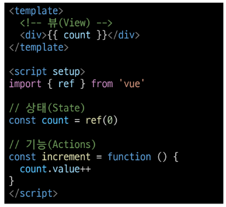
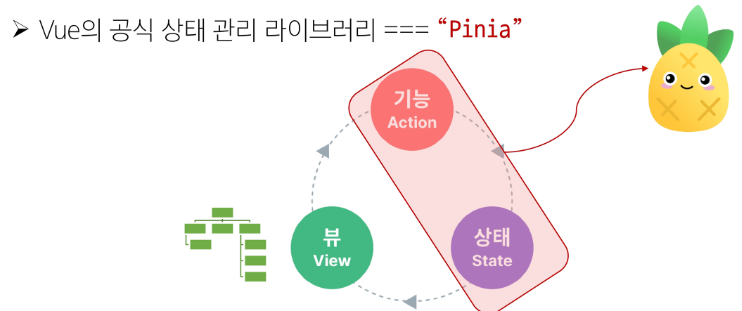

# State Management (상태 관리)
- 상태 >>> 데이터

## 컴포넌트 구조의 단순화

- 상태(State): 앱 구동에 필요한 기본 데이터
- 뷰(View): 상태를 선언적으로 매핑하여 시각화
- 기능(Actions): 뷰에서 사용자 입력에 대해 반응적으로 상태를 변경할 수 있게 정의된 동작
> '단방향 데이터 흐름'의 간단한 표현

### 상태 관리의 단순성이 무너지는 시점
> 여러 컴포넌트가 상태를 공유할 때
1. 여러 뷰가 동일한 상태에 종속되는 경우
   - 공유 상태를 공통 조상 컴포넌트로 '끌어올린' 다음 props로 전달하는 것
   - 하지만 계층 구조가 깊어질 경우 비효율적, 관리가 어려워 짐
2. 서로 다른 뷰의 기능이 동일한 상태를 변경시켜야 하는 경우
   - 발신(emit)된 이벤트를 통해 상태의 여러 복사본을 변경 및 동기화 하는 것
   - 마찬가지로 관리의 패턴이 깨지기 쉽고 유지 관리할 수 없는 코드가 됨

> <b>따라서 각 컴포넌트의 공유 상태를 추출하여 전역에서 참조할 수 있는 저장소에서 관리</b>
> - 컴포넌트 트리는 하나의 큰 View가 되고 모든 컴포넌트는 트리 계층 구조에 관계 없이 상태에 접근하거나 기능을 사용할 수 있음
> 

# Pinia
## 구성 요소
### 1. 'store'
- 중앙 저장소
- 모든 컴포넌트가 공유하는 상태, 기능 등이 작성됨
- `defineStore()`의 반환 값의 이름은 use와 store를 사용하는 것을 권장
- `defineStore()`의 첫 번째 인자는 애플리케이션 전체에 설쳐 사용하는 store의 고유 ID

### 2. 'state'
- 반응형 상태(데이터)
- `ref === state`
- 각 검포넌트의 깊이에 관계 없이 store 인스턴스로 state에 접근하여 직접 읽고 쓸 수 있음
- 만약 store에 state를 정의하지 않았다면 컴포넌트에서 새로 추가할 수 없음

### 3. 'getters'
- 계산된 값
- `computed() === getters`
- store의 모든 getters 또한 state 처럼 직접 접근할 수 있음

### 4. 'actions'
- 메서드
- `function() === actions`
- store의 모든 actions 또한 직접 접근 및 호출할 수 있음
- getters와 달리 state 조작, 비동기, API 호출이나 다른 로직을 진행할 수 있음

#### pinia의 상태들을 사용하려면 반드시 반환해야 함

### 5. 'plugin'
- 애플리케이션의 상태 관리에 필요한 추가 기능을 제공하거나 확장하는 도구나 모듈
- 애플리케이션의 상태 관리를 더욱 간편하고 유연하게 만들어주며 패키지 매니저로 설치 이후 별도 설정을 통해 추가 됨

# Local Storage
- 브라우저 내에 key-value 쌍을 저장하는 웹 스토리지 객체
- 페이지를 새로고침하고 브라우저를 다시 실행해도 데이터가 유지
- 쿠키와 다르게 네트워크 요청 시 서버로 전송되지 않음
- 여러 탭이나 창 간에 데이터를 공유할 수 있음
- 웹 애플리케이션에서 사용자 설정, 상태 정보, 캐시 데이터 등을 클라이언트 측에서 보관하여 웹 사이트의 성능을 향상시키고 사용자 경험을 개선하기 위함

# Pinia, 언제 사용해야 할까?
- Pinia는 공유된 상태를 관리하는 데 유용하지만, 구조적인 개념에 대한 이해와 시작하는 비용이 큼
- 애플리케이션이 단순하다면 Pinia가 없는 것이 더 효율적일 수 있음
- 그러나 중대형 규모의 SPA를 구축하는 경우 Pinia는 자연스럽게 선택할 수 있는 단계가 오게 됨
- 결과적으로 적절한 상황에서 활용했을 때 Pinia 효용을 극대화 할 수 있음